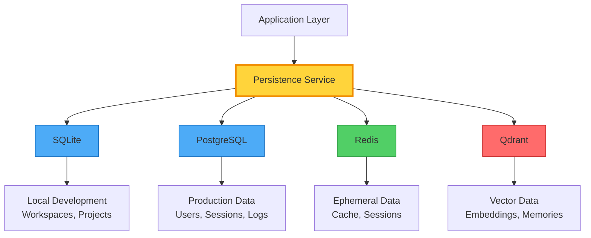

<!--
  ⚠  AUTO-GENERATED — DO NOT EDIT MANUALLY
  Generated by: aios.docgen diagram generator
  Generated on: 2026-07-07T15:30:07Z
  This file is recreated on every generation run.
  Edit the source code and re-run the generator to update this file.
-->

# Persistence Architecture

> Multi-layer persistence architecture with SQL, NoSQL, and vector stores.

## Persistence Layers

## Storage Layer Details

### SQLite (SQL)

**Purpose**: Local development and lightweight persistence

**Repositories**: 32

### PostgreSQL (SQL)

**Purpose**: Production relational data storage

**Repositories**: 32

### Redis (NOSQL)

**Purpose**: Caching and ephemeral data

**Repositories**: 32

### Qdrant (VECTOR)

**Purpose**: Semantic memory and vector search

