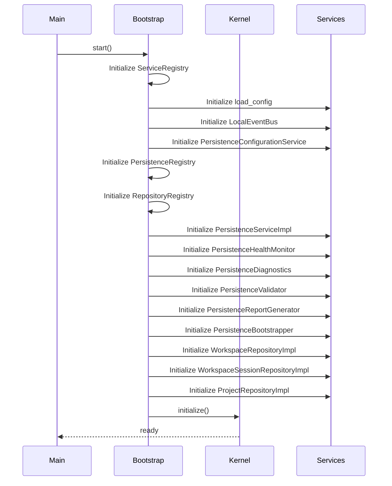

<!--
  ⚠  AUTO-GENERATED — DO NOT EDIT MANUALLY
  Generated by: aios.docgen diagram generator
  Generated on: 2026-07-07T06:46:24Z
  This file is recreated on every generation run.
  Edit the source code and re-run the generator to update this file.
-->

# Bootstrap Sequence

> System initialization sequence showing bootstrap steps.

## Bootstrap Flow

## Bootstrap Steps

1. **Initialize ServiceRegistry**: Create and configure ServiceRegistry instance
2. **Initialize load_config**: Create and configure load_config instance
3. **Initialize LocalEventBus**: Create and configure LocalEventBus instance
4. **Initialize PersistenceConfigurationService**: Create and configure PersistenceConfigurationService instance
5. **Initialize PersistenceRegistry**: Create and configure PersistenceRegistry instance
6. **Initialize RepositoryRegistry**: Create and configure RepositoryRegistry instance
7. **Initialize PersistenceServiceImpl**: Create and configure PersistenceServiceImpl instance
8. **Initialize PersistenceHealthMonitor**: Create and configure PersistenceHealthMonitor instance
9. **Initialize PersistenceDiagnostics**: Create and configure PersistenceDiagnostics instance
10. **Initialize PersistenceValidator**: Create and configure PersistenceValidator instance
11. **Initialize PersistenceReportGenerator**: Create and configure PersistenceReportGenerator instance
12. **Initialize PersistenceBootstrapper**: Create and configure PersistenceBootstrapper instance
13. **Initialize WorkspaceRepositoryImpl**: Create and configure WorkspaceRepositoryImpl instance
14. **Initialize WorkspaceSessionRepositoryImpl**: Create and configure WorkspaceSessionRepositoryImpl instance
15. **Initialize ProjectRepositoryImpl**: Create and configure ProjectRepositoryImpl instance
