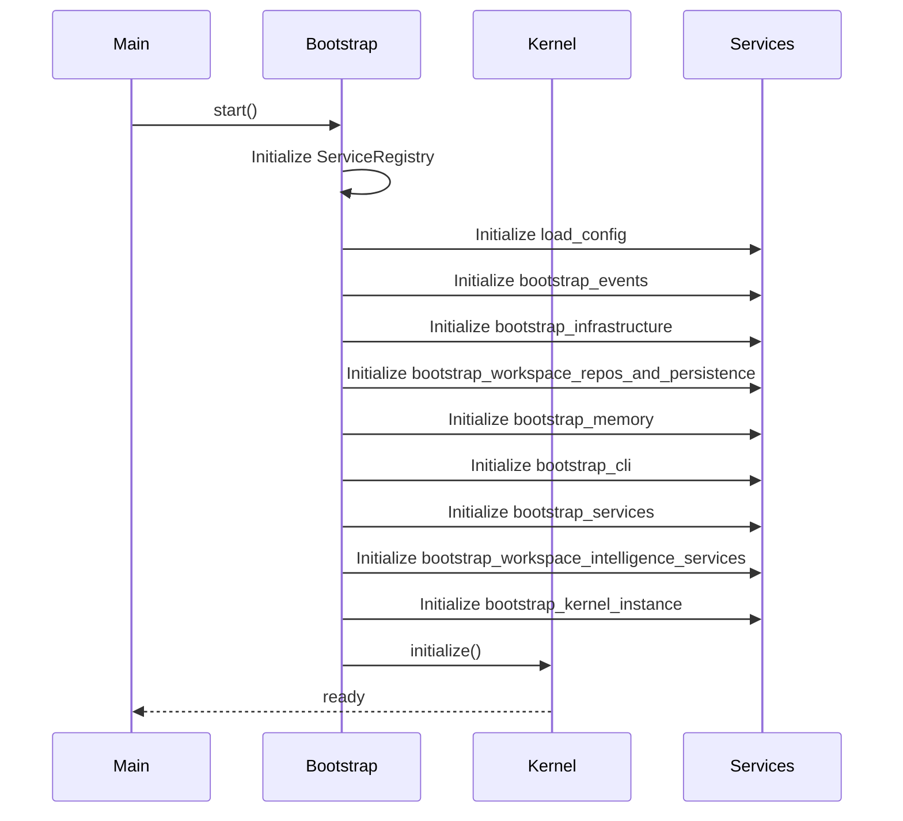

<!--
  ⚠  AUTO-GENERATED — DO NOT EDIT MANUALLY
  Generated by: aios.docgen diagram generator
  Generated on: 2026-07-13T17:22:38Z
  This file is recreated on every generation run.
  Edit the source code and re-run the generator to update this file.
-->

# Bootstrap Sequence

> System initialization sequence showing bootstrap steps.

## Bootstrap Flow

## Bootstrap Steps

1. **Initialize ServiceRegistry**: Create and configure ServiceRegistry instance
2. **Initialize load_config**: Create and configure load_config instance
3. **Initialize bootstrap_events**: Create and configure bootstrap_events instance
4. **Initialize bootstrap_infrastructure**: Create and configure bootstrap_infrastructure instance
5. **Initialize bootstrap_workspace_repos_and_persistence**: Create and configure bootstrap_workspace_repos_and_persistence instance
6. **Initialize bootstrap_memory**: Create and configure bootstrap_memory instance
7. **Initialize bootstrap_cli**: Create and configure bootstrap_cli instance
8. **Initialize bootstrap_services**: Create and configure bootstrap_services instance
9. **Initialize bootstrap_workspace_intelligence_services**: Create and configure bootstrap_workspace_intelligence_services instance
10. **Initialize bootstrap_kernel_instance**: Create and configure bootstrap_kernel_instance instance
