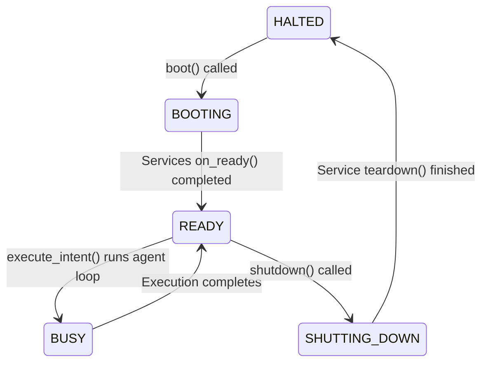

# Runtime & Execution Architecture Standards
**Engineering Bible — Milestone 3**
**Version 1.0** · *Classified: For One Person Only* · *July 2026*

---

## 1. Kernel Runtime States

The `Kernel` governs service orchestration and manages runtime state transitions. The active execution phase is tracked using the `RuntimeState` state machine:

### State Definitions
* **`HALTED`**: The default state. No resources are allocated and no services are running.
* **`BOOTING`**: The startup phase. Configurations are loaded, services are registered, and service lifecycles are initialized.
* **`READY`**: The system is waiting for commands. The REPL loop is active and sessions are registered.
* **`BUSY`**: The system is executing a task or agent cognitive loop. Incoming commands are queued or blocked.
* **`SHUTTING_DOWN`**: The system is executing teardowns. Sessions are flushed and connection handles are closed.

---

## 2. Agent Runtime Orchestration

The `AgentRuntimeService` manages the execution of cognitive and orchestrative tasks.
* **Brain Orchestrator**: Leverages the `ModelService` to parse requests, fetch memories, select skills, and generate execution plans containing discrete tool invocations.
* **Task Executor**: Executes structured sequential command plans, tracking and logging state outputs to `.aios_tasks/` to enable session resumption.

---

## 3. Safe Mutating Steps & Rollbacks

All filesystem modifications must be handled through the `ActionEngine` to ensure safety and prevent data loss.

### Reversibility Guidelines
* **Pre-Mutation Caching**: Prior to executing any filesystem write, edit, or deletion, the `ActionEngine` must cache the target file's current contents in a temporary location inside `.aios_tasks/`.
* **Rollback Coordinator**: If any execution step fails or is aborted, the `RollbackCoordinator` is invoked to restore the cached file states, rolling back changes and leaving the workspace clean.

---

## 4. Human-in-the-Loop Approval Gating

To prevent security compromises, operations are categorized by risk level:

| Risk Classification | Operations | Handling |
|---------------------|------------|----------|
| **`LOW`** | File reads, directory listing, checking repository status. | Automatic execution; no approval needed. |
| **`MEDIUM`** | File edits inside the workspace, staging git changes. | Executed with inline logger warnings. |
| **`HIGH`** | Deleting files, modifying code outside the workspace, running terminal scripts. | Blocked; requires explicit approval via CLI prompt. |

All HIGH-risk operations must prompt the user for explicit verification before execution. The approval engine logs the request, payload, and approval decision for auditing.

---

*Engineering Bible Architecture Standards · Personal AI OS · Sprint 8 M3 · Governed by [02_ARCHITECTURE_GUIDELINES.md](file:///Users/anzarakhtar/aios/docs/02_ARCHITECTURE_GUIDELINES.md)*
