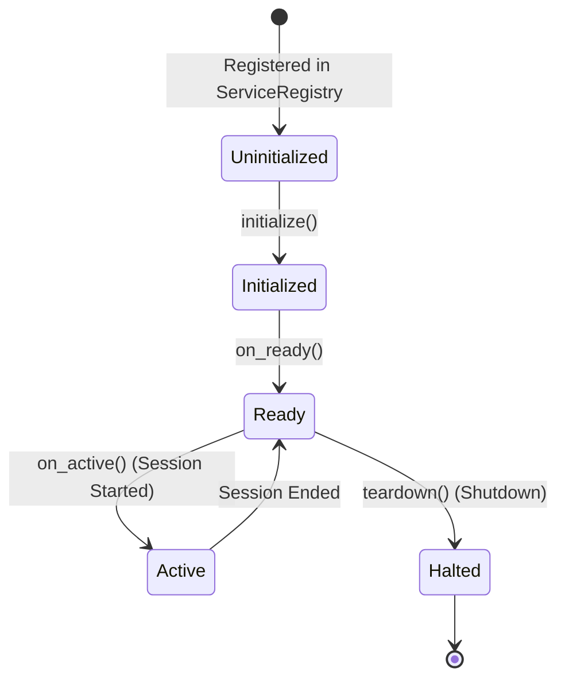

# Service Lifecycle Standards
**Engineering Bible — Milestone 3**
**Version 1.0** · *Classified: For One Person Only* · *July 2026*

---

## 1. The ServiceLifecycle Contract

Every core service in the Personal AI OS must inherit from the `ServiceLifecycle` base class (defined in [base.py](file:///Users/anzarakhtar/aios/core/src/aios/services/base.py)). This base class manages transition sequencing, tracking, and teardown execution.

---

## 2. Lifecycle Stages

A service transitions through four distinct lifecycle hooks managed directly by the Kernel:

### Stage 1: `initialize()`
* **Trigger**: Invoked by the Kernel boot sequence immediately after service registration.
* **Responsibilities**:
  * Verify service configurations and environmental properties.
  * Establish external connection pools (such as DB or Redis clients).
  * Configure internal state variables.
* **Constraints**: Services must not interact with other services or publish events during `initialize()` because other services may not be registered yet.

### Stage 2: `on_ready()`
* **Trigger**: Invoked after all services have completed their `initialize()` step.
* **Responsibilities**:
  * Resolve dependencies from the registry.
  * Subscribe callback functions to relevant Event Bus topic streams.
  * Launch background helper tasks (such as telemetry aggregate sweeps).
* **Constraints**: Event publishing is permitted from this stage onwards.

### Stage 3: `on_active()`
* **Trigger**: Invoked when an interactive user session starts or transitions to active.
* **Responsibilities**:
  * Load session histories and compile contextual memory buckets.
  * Associate session-level assets (like file queues or session-specific settings).

### Stage 4: `teardown()`
* **Trigger**: Invoked during graceful system shutdown.
* **Responsibilities**:
  * Flush internal cache write buffers to database tables.
  * Terminate background worker processes.
  * Safely close file locks, database connections, and port handles.
* **Constraints**: Must execute in reverse order of service registration to prevent invalid dependency references during teardown.

---

## 3. Transition Safety & Idempotency Rules

* **Metaclass Protection**: The `ServiceLifecycle` base class automatically wraps lifecycle methods with internal guard flags (e.g. `_lifecycle_initialized`, `_lifecycle_ready`, `_lifecycle_teardown`). If a method is invoked repeatedly, the guard blocks redundant calls.
* **Error Handling inside Teardown**: Code inside `teardown()` must never raise unhandled exceptions. Failures during teardown should be caught and logged as stderr output, ensuring that other services are still given a chance to close down gracefully.

---

*Engineering Bible Architecture Standards · Personal AI OS · Sprint 8 M3 · Governed by [02_ARCHITECTURE_GUIDELINES.md](file:///Users/anzarakhtar/aios/docs/02_ARCHITECTURE_GUIDELINES.md)*
