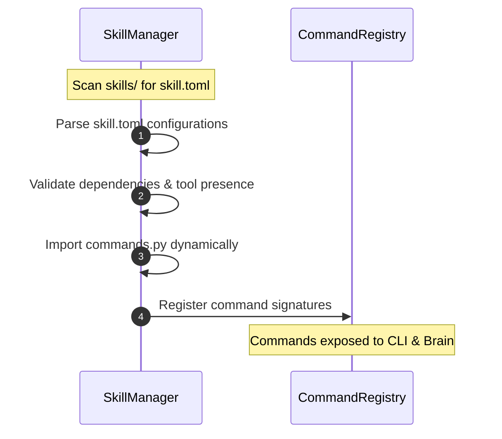

# Skill Capability Architecture Standards
**Engineering Bible — Milestone 3**
**Version 1.0** · *Classified: For One Person Only* · *July 2026*

---

## 1. Skill Package Structure

Capabilities in the Personal AI OS are structured as modular, self-contained packages under the [skills/](file:///Users/anzarakhtar/aios/skills/) directory. Each skill package must conform to the following layout:

```
skills/my_new_capability/
├── skill.toml          ← Metadata and dependency manifest
├── commands.py         ← Command registration hooks and handlers
└── prompts/            ← System prompt templates (markdown files)
    ├── system.md
    └── analysis.md
```

### Manifest Specifications (`skill.toml`)
Each manifest must define the following metadata blocks:
* **`[skill]`**: Contains unique capability names, versions, and authors.
* **`[dependencies]`**: Declares required platform dependencies, tools, or model features.
* **`[commands]`**: Declares command signatures and descriptions exposed to the CLI.

---

## 2. Dynamic Discovery & Loading

At system startup, the `SkillManager` dynamically registers skills through the following sequence:



1. **Scan**: The manager scans the directory tree for `skill.toml` manifests.
2. **Validate**: Checks that declared dependencies (like `git` or specific API services) are registered.
3. **Import**: Imports the skill's `commands.py` module.
4. **Register**: Calls `register_commands(registry)` inside `commands.py` to bind command strings to execution callback handlers.

---

## 3. The Command Registry & Fallback Execution

* **CommandRegistry**: A central repository that stores all active command signatures, parameter contracts, and execution lambdas.
* **Command Binding**: Commands parse input arguments and map them directly to execution parameters.
* **Natural Language Fallback**: If an entered query doesn't match any command signature in the registry, the `LocalIntentResolver` redirects the query to the `Brain` orchestrator. The Brain then uses natural language model prompts to determine which skills or tools to coordinate to resolve the request.

---

*Engineering Bible Architecture Standards · Personal AI OS · Sprint 8 M3 · Governed by [02_ARCHITECTURE_GUIDELINES.md](file:///Users/anzarakhtar/aios/docs/02_ARCHITECTURE_GUIDELINES.md)*
