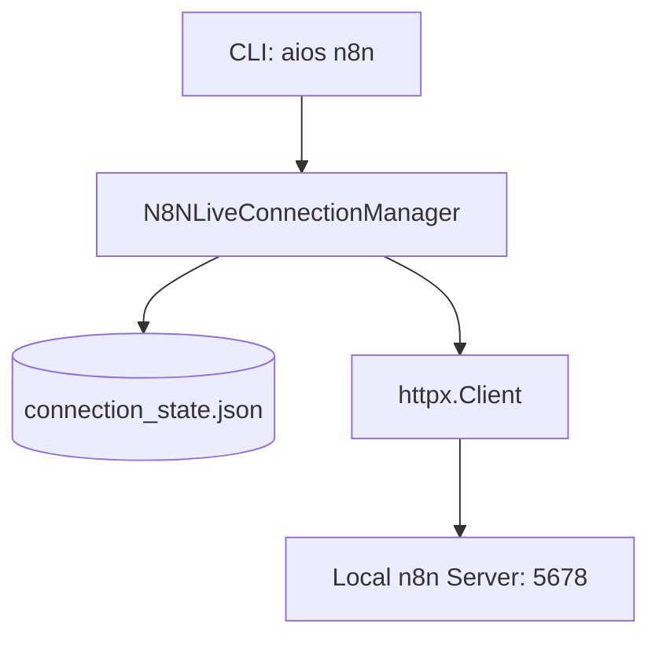

# n8n Live Integration Architecture & Connection Guide

This document describes the design, API contracts, CLI subcommands, and connection guide for the Personal AI OS to n8n integration subsystem.

---

## 1. Architectural Architecture

The live integration layer handles client pings, auto-discovery, authentication configurations, and connection state persistence.



---

## 2. API Reference & Client Design

- **`N8NLiveConnectionManager`**: Loads/saves configuration state from/to `.aios_n8n_cache/connection_state.json`.
- **`discover_instances(ports)`**: Iterates over localhost and common ports (5678, 5679, 8000) checking if `/healthz` is listening.
- **`connect(url, auth_type, api_key, email, password)`**: Performs a handshake verify, caches connection details upon 200 OK health response, and updates status markdown pages.
- **`disconnect()`**: Resets connection state variables in local storage.

---

## 3. CLI Command Guide

All subcommands are exposed via the `aios n8n` namespace:

| Subcommand | Action / Usage |
| --- | --- |
| `aios n8n connect` | `aios n8n connect [url] [--auth type] [--api-key key] [--email mail] [--password pass]` |
| `aios n8n disconnect` | Resets active connection configurations. |
| `aios n8n status` | Prints whether active connection is online or offline. |
| `aios n8n version` | Detects and prints active n8n instance version. |
| `aios n8n health` | Measures and reports roundtrip ping latency (ms). |
| `aios n8n config` | Displays active configurations (obfuscating secrets). |
| `aios n8n test` | Performs sequential endpoint diagnostic tests. |

---

## 4. Connection & Setup Guide

### 4.1 Anonymous Setup
If your local n8n instance is running without authentication (default in local setups):
```bash
aios n8n connect http://localhost:5678
```

### 4.2 API Key Setup
For n8n instances requiring API keys:
```bash
aios n8n connect http://localhost:5678 --auth api_key --api-key YOUR_N8N_API_KEY
```

### 4.3 Basic Session Authentication
For login credentials:
```bash
aios n8n connect http://localhost:5678 --auth basic --email admin@example.com --password YOUR_PASSWORD
```
