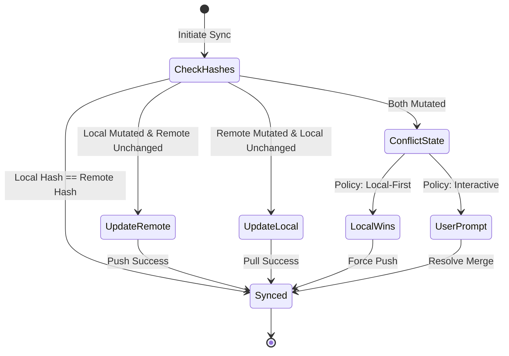

# Notion Intelligence — Architecture Specification
**Sprint 9 · Milestone 1 (Foundation)** · Version 1.0 · July 2026

---

## Document Metadata
* **Purpose**: Define the technical architecture, class interfaces, components, and sync state machines for the Notion Intelligence module.
* **Scope**: Governs Python service classes, database replicas, and provider interfaces in the monorepo.
* **Audience**: Systems Architects, Lead Developers, and AI coding agents.
* **Related Documents**:
  * [02_ARCHITECTURE_GUIDELINES.md](file:///Users/anzarakhtar/aios/docs/02_ARCHITECTURE_GUIDELINES.md) - Dependency Injection and registry rules.
  * [17_KNOWLEDGE_BASE.md](file:///Users/anzarakhtar/aios/docs/17_KNOWLEDGE_BASE.md) - Core system data models catalog.
  * [notion/notion_intelligence.md](file:///Users/anzarakhtar/aios/docs/notion/notion_intelligence.md) - Conceptual vision.

---

## 1. High-Level Architecture

Following the **Dependency Inversion Principle (DIP)** established in [02_ARCHITECTURE_GUIDELINES.md](file:///Users/anzarakhtar/aios/docs/02_ARCHITECTURE_GUIDELINES.md), services depend on abstract contracts. The `KnowledgeHubService` coordinates multiple knowledge sources via the `KnowledgeProvider` interface.

```
                  +-----------------------------------+
                  |        ServiceRegistry            |
                  +-----------------------------------+
                                    |
                                    v
                  +-----------------------------------+
                  |        KnowledgeHubService        |
                  +-----------------------------------+
                                    |
                                    v
                  +-----------------------------------+
                  |        KnowledgeProvider          | (Abstract Interface)
                  +-----------------------------------+
                                    ^
                                    |
                  +-----------------------------------+
                  |         NotionProvider            | (Concrete Implementation)
                  +-----------------------------------+
                   /                |                \
                  v                 v                 v
      +---------------+     +---------------+     +---------------+
      |  NotionSync   |     |   SyncState   |     |  NotionAPI    |
      |    Engine     |     |     Store     |     |    Client     |
      +---------------+     +---------------+     +---------------+
              |                     |                     |
              v                     v                     v
      +---------------+     +---------------+             | (Remote HTTP)
      | Qdrant Vector |     | SQLite Cache  |             v
      |     Index     |     | (SQLCipher)   |     [Notion API Cloud]
      +---------------+     +---------------+
```

---

## 2. Component Deep Dive

### 2.1 KnowledgeHubService
* **Namespace**: `aios.services.knowledge_hub`
* **Responsibility**: Central conductor for registering providers and orchestrating sync operations across Obsidian, Google Drive, and Notion.
* **Interface**:
  ```python
  class KnowledgeHubService(ABC):
      @abstractmethod
      def register_provider(self, provider: KnowledgeProvider) -> None:
          """Register a concrete knowledge provider (e.g. NotionProvider)."""
          pass

      @abstractmethod
      def get_provider(self, name: str) -> Optional[KnowledgeProvider]:
          """Retrieve a provider by unique identifier."""
          pass

      @abstractmethod
      def sync_document(self, doc: KnowledgeDocument, provider_name: str) -> KnowledgeSyncResult:
          """Push/pull a specific document to/from a registered provider."""
          pass

      @abstractmethod
      def get_sync_status(self, document_id: str) -> Optional[KnowledgeMetadata]:
          """Query the sync database for metadata records matching an ID."""
          pass
  ```

### 2.2 NotionProvider
* **Namespace**: `aios.providers.notion.provider`
* **Responsibility**: Implements `KnowledgeProvider`. Translates generic OS `KnowledgeDocument` schemas to Notion Page/Block API formats. Coordinates the inner sync engine and client.
* **Interface**:
  ```python
  class NotionProvider(KnowledgeProvider):
      def get_name(self) -> str:
          """Return "notion"."""
          pass

      def pull_document(self, external_id: str) -> KnowledgeDocument:
          """Fetch a page from Notion, parse its block AST, and return a document."""
          pass

      def push_document(self, doc: KnowledgeDocument) -> KnowledgeSyncResult:
          """Write a local document to a Notion page or append to a database."""
          pass
  ```

### 2.3 NotionAPIClient
* **Namespace**: `aios.providers.notion.client`
* **Responsibility**: Low-level client handling connection pooling, HTTP headers, rate-limiting retry protocols (back-off), and error formatting. Operates in two modes:
  1. `LiveNotionAPIClient`: Makes HTTPS requests to `https://api.notion.com/v1/`.
  2. `OfflineMockClient`: Simulates successful responses from a local test database (essential for testing and offline development).

### 2.4 SyncStateStore
* **Namespace**: `aios.providers.notion.storage`
* **Responsibility**: Manages the local SQLite database replica. Tracks mappings, hashes, and timestamps.
* **Schema**:
  ```sql
  CREATE TABLE IF NOT EXISTS notion_sync_state (
      document_id TEXT PRIMARY KEY,
      external_page_id TEXT NOT NULL,
      external_parent_id TEXT,
      last_synced_at TIMESTAMP DEFAULT CURRENT_TIMESTAMP,
      local_hash TEXT NOT NULL,
      remote_hash TEXT NOT NULL,
      sync_status TEXT CHECK(sync_status IN ('SYNCED', 'MUTATED_LOCAL', 'MUTATED_REMOTE', 'CONFLICT')) NOT NULL
  );
  
  CREATE TABLE IF NOT EXISTS offline_write_queue (
      queue_id INTEGER PRIMARY KEY AUTOINCREMENT,
      document_id TEXT NOT NULL,
      operation TEXT CHECK(operation IN ('CREATE', 'UPDATE', 'APPEND_COMMENT')) NOT NULL,
      payload TEXT NOT NULL,
      queued_at TIMESTAMP DEFAULT CURRENT_TIMESTAMP
  );
  ```

---

## 3. Sync State Machine & Verification Flow

Sync operations evaluate changes to local files and remote pages using MD5 hash verifications.



### 3.1 Conflict Resolution Policies
1. **Local-Wins (Default for System Reports)**: Used when syncing automated reports (e.g. test summaries, diagnostics). The local OS output overwrites changes on Notion.
2. **Interactive Merge (Default for Shared Pages)**: Prompts the user via the REPL console with inline diff blocks, letting them choose which change to accept or perform a line-by-line merge.

### 3.2 Notion API Rate Limits & Mitigation
The Notion API enforces a limit of **3 requests per second per integration**.
* **Jittered Back-off**: The `NotionAPIClient` uses a token-bucket rate limiter that delays outgoing calls when approaching thresholds, applying exponential back-off (`2^attempt * baseline + jitter`).
* **Batch Operations**: Instead of writing blocks line-by-line, the API client batches block additions (up to 100 blocks per request) to minimize API round-trips.
