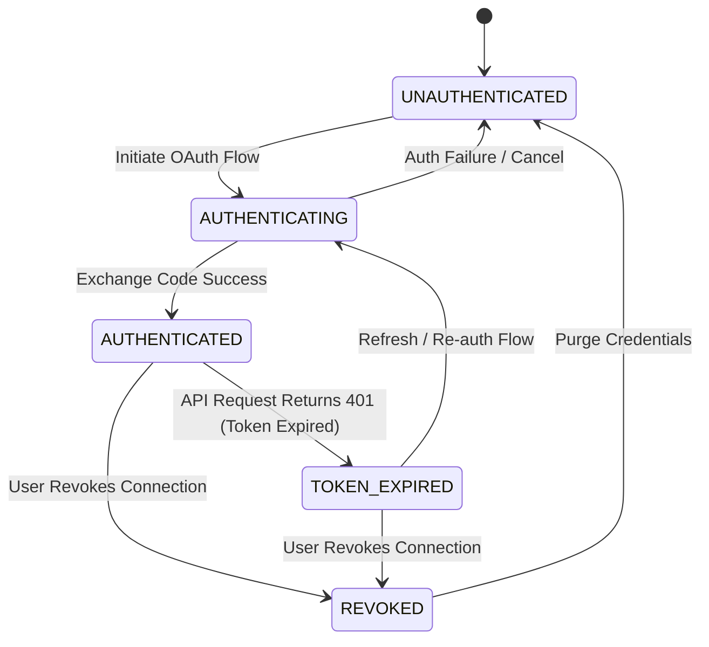

# Notion Intelligence — Authentication Subsystem
**Sprint 9 · Milestone 2** · Version 1.0 · July 2026

---

## Document Metadata
* **Purpose**: Define the high-level architecture, design principles, state machines, and classes for the Notion Authentication subsystem.
* **Scope**: Governs Python authentication manager services, session state classes, and client-facing hooks.
* **Audience**: Systems Architects, Security Engineers, and AI coding agents.
* **Related Documents**:
  * [05_SECURITY_GUIDELINES.md](file:///Users/anzarakhtar/aios/docs/05_SECURITY_GUIDELINES.md) - Project-wide security policies.
  * [notion/security_model.md](file:///Users/anzarakhtar/aios/docs/notion/security_model.md) - Notion security foundation.
  * [notion/authentication/README.md](file:///Users/anzarakhtar/aios/docs/notion/authentication/README.md) - Navigation hub.

---

## 1. Subsystem Overview

The Notion Authentication subsystem is responsible for authenticating the Personal AI OS with the remote Notion API. Because the OS is a local-first application running on the user's local machine, authentication must be managed locally, securely storing OAuth access tokens and credentials without depending on intermediate cloud-based auth proxies.

The authentication logic is encapsulated in the `NotionAuthManager` service, which runs under the `NotionProvider` and registers in the main `ServiceRegistry`.

---

## 2. Authentication State Machine

The authentication state of the Notion provider is managed dynamically. The system transitions through five distinct states:



### State Definitions
* **`UNAUTHENTICATED`**: No credentials exist locally. API requests are blocked.
* **`AUTHENTICATING`**: The OS is hosting a local loopback server and waiting for the user to complete the OAuth redirect in their web browser.
* **`AUTHENTICATED`**: A valid integration token or OAuth token is available and successfully verified against the Notion API.
* **`TOKEN_EXPIRED`**: The remote API returned an authorization error. Token requires re-validation or refresh exchange.
* **`REVOKED`**: The connection is flagged as disabled. Credentials remain cached but disabled, or are immediately purged from disk.

---

## 3. Core Class Interfaces

To decouple authentication from HTTP networking, the subsystem exposes the following Python interfaces under `aios.providers.notion.auth`:

```python
class NotionAuthState(Enum):
    UNAUTHENTICATED = "UNAUTHENTICATED"
    AUTHENTICATING = "AUTHENTICATING"
    AUTHENTICATED = "AUTHENTICATED"
    TOKEN_EXPIRED = "TOKEN_EXPIRED"
    REVOKED = "REVOKED"


class NotionSession:
    def __init__(self, workspace_id: str, access_token: str, state: NotionAuthState):
        self.workspace_id = workspace_id
        self.access_token = access_token
        self.state = state
        self.authenticated_at = datetime.utcnow()


class NotionAuthManager(ABC):
    @abstractmethod
    def get_session(self, workspace_id: str) -> Optional[NotionSession]:
        """Retrieve the active session and verify its validity."""
        pass

    @abstractmethod
    def initiate_auth(self, workspace_name: str) -> NotionSession:
        """Trigger the OAuth flow and acquire a new session."""
        pass

    @abstractmethod
    def validate_session(self, session: NotionSession) -> bool:
        """Query Notion's user endpoint to verify token integrity."""
        pass

    @abstractmethod
    def revoke_session(self, workspace_id: str) -> bool:
        """Revoke the token and clean local credential registers."""
        pass
  ```
