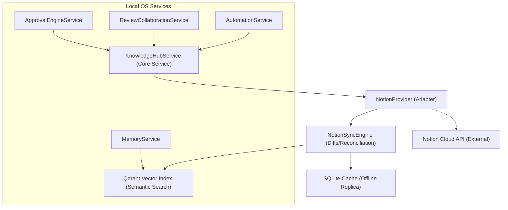

# Notion Intelligence — Conceptual Vision & Product Framework
**Sprint 9 · Milestone 1 (Foundation)** · Version 1.0 · July 2026

---

## Document Metadata
* **Purpose**: Establish the core product vision, conceptual framework, and guiding principles of Notion Intelligence.
* **Scope**: Governs all subsequent architectural and functional specifications of the Notion module.
* **Audience**: Systems Architects, AI Agents, and the Owner.
* **Related Documents**:
  * [00_PROJECT_VISION.md](file:///Users/anzarakhtar/aios/docs/00_PROJECT_VISION.md) - Project Constitution.
  * [16_ENGINEERING_BIBLE.md](file:///Users/anzarakhtar/aios/docs/16_ENGINEERING_BIBLE.md) - Low-level monorepo execution reference.
  * [notion/README.md](file:///Users/anzarakhtar/aios/docs/notion/README.md) - Navigation hub.

---

## 1. Executive Summary & Core Paradigm

The **Notion Intelligence** module is the bridge connecting the local-first execution layer of the **Personal AI OS** to the structured, collaborative workspace canvas of **Notion**. 

In most modern AI setups, external workspaces are either accessed as ad-hoc read/write endpoints or used as dumping grounds for raw text logs. Under the Personal AI OS paradigm, the relationship is structured, bidirectional, and deeply integrated:

```
+------------------------------------------+       +------------------------------------------+
|          PERSONAL AI OS (Local)          |       |          NOTION WORKSPACE (Cloud)        |
|                                          |       |                                          |
|  - Reasoning Engine & Code Compiler      |       |  - Collaborative Document Canvas         |
|  - Fast Local Memory (SQLite + Qdrant)   | <===> |  - Structured Database Schemas           |
|  - Tool & Task Execution Subprocess      |       |  - Shared Review/Discussion Threads      |
|  - Active Workspace Files & Git State    |       |  - User Task Boards & Profiles           |
+------------------------------------------+       +------------------------------------------+
```

* **Notion is the Collaborative Canvas**: It provides an interface for structured project tracking, human-readable documentation, career boards, and interactive reviews.
* **Personal AI OS is the Cognitive Executor**: It acts as the local, secure runtime that reads goals, generates artifacts, updates database status codes, builds semantic vector indexes, and automates notifications.

---

## 2. Why Notion?

While the Personal AI OS is strictly **local-first and privacy-focused**, we recognize that modern professional life requires sharing plans, collaborating on code reviews, and maintaining career tracking frameworks that are accessible across devices. Notion acts as an ideal external canvas because:
1. **Rich Structural Models**: Notion organizes data into a clean, hierarchical AST of Blocks, Pages, and Databases rather than raw unformatted text.
2. **Built-in Collaboration**: Notion supports multi-user comments, permissions, and history tracking out-of-the-box.
3. **Structured Schemas**: Databases enable mapping Python dataclasses directly to typed table rows (e.g. tracking job applications, release checklists, and approval states).

The Notion Intelligence module makes this external workspace fully comprehensible to the local AI OS, treating Notion pages and databases as primary memory context blocks.

---

## 3. Core Philosophy & Guiding Laws

The development of Notion Intelligence is bound by the core principles of the [Project Constitution](file:///Users/anzarakhtar/aios/docs/00_PROJECT_VISION.md):

### 3.1 Local-First & Offline-First
The AI OS does not depend on the Notion API to function. All synced Notion pages are cached locally in an encrypted database replica. If the network goes offline, the OS continues to resolve commands and execute local tasks, queueing mutations to be reconciled later.

### 3.2 Security by Least Privilege
The integration token must never have full admin access to the workspace. Access is scoped strictly to parent page structures manually shared by the user. Destructive commands (e.g., deleting pages or databases) are blocked by default and require human approval.

### 3.3 Semantic Transparency
Every page synced from Notion must be converted to plain Markdown, chunked, and embedded into local vector storage (`Qdrant`). This guarantees that notes taken on Notion are instantly accessible via semantic search within the local REPL console.

---

## 4. Subsystem Relationships

Notion Intelligence interacts with core local services as defined in [17_KNOWLEDGE_BASE.md](file:///Users/anzarakhtar/aios/docs/17_KNOWLEDGE_BASE.md):



* **Knowledge Hub Integration**: Implements the `KnowledgeProvider` contract.
* **Tiered Memory System**: Feeds structured page contents into the Memory Service.
* **Approval & Review Services**: Publishes Consensus metrics and maps review comments to Notion pages on-demand.
* **Automation Engine**: Translates DAG configurations and outputs execution reports directly to Notion database logs.
