# AI Memory Persistence Architecture

This document describes the architecture, database schema, repository mappings, and coordination lifecycle of the AI Memory Persistence subsystem in the Personal AI OS.

## 1. System Overview

The AI Memory Persistence subsystem integrates the AI Provider registry, health tracking, token usage quotas, failovers, selector configurations, and episodic memory facts with the durable SQLite/PostgreSQL Database Transport layer.

```mermaid
graph TD
    PR[ProviderRegistry] -->|Write-through/Read-through| AIProviderRepo[AIProviderRepository]
    PHM[ProviderHealthMonitor] -->|Metrics/Availability| HealthRepo[ProviderHealthRepository]
    PHM -->|Latency History| TelemRepo[ProviderTelemetryRepository]
    PHM -->|Stats Counters| StatsRepo[ProviderStatisticsRepository]
    PHM -->|Daily/Monthly Cost Quotas| QuotaRepo[ProviderQuotaRepository]
    PHM -->|Daily/Monthly Token Tracker| UsageRepo[AIUsageStatisticsRepository]
    Router[ProviderRouter] -->|Decision logs| RouteRepo[ProviderRoutingRepository]
    Router -->|Failovers| FailRepo[ProviderFailoverRepository]
    Router -->|Execution Checkpoints| CheckRepo[ProviderCheckpointRepository]
    Memory[LocalMemoryService] -->|Episodic Facts| MemoryRepo[AIMemoryRepository]
```

## 2. Schema Mappings & Tables

Twelve new tables are registered and managed inside the SQLite/PostgreSQL transport:

1. **ai_providers**: Registry details (name, priority, status, costs, etc.).
2. **provider_capabilities**: Capability maps (streaming, vision, reasoning, structured output, etc.).
3. **provider_health**: Live health indicators (success rate, circuit breaker state, rate limit until, availability %, etc.).
4. **provider_telemetry**: Performance profiles (query latencies list, average latency, p95 latency, etc.).
5. **provider_statistics**: Operational counters (total requests, successes, failures, error logs, etc.).
6. **provider_quotas**: Budgets (quota limit, quota used, remaining quota, exhaustion state, etc.).
7. **provider_routing**: Decision tracking (selected provider/model, alternative candidates, routing strategy, reference keys, etc.).
8. **provider_sessions**: LLM session lifecycle tracking (metadata, states, tokens used, active flags, etc.).
9. **provider_checkpoints**: Serialized runtime contexts saved before retries or failover execution.
10. **provider_failovers**: Switch events (source provider, target provider, error message, and corresponding checkpoint reference).
11. **ai_usage_statistics**: Cumulative token tracker (daily and monthly input/output tokens, total cost, etc.).
12. **ai_memory**: Durable episodic and semantic facts (key, value, metadata, etc.).

## 3. Strict vs Best Effort Policy

To match the existing persistence framework requirements, AI Memory Persistence supports two modes of operational policy:

- **STRICT**: Validates all incoming data formats against strict schemas. If validation fails or a query fails, it raises `RuntimeError` immediately, halting the calling operation.
- **BEST_EFFORT**: Logs failures to telemetry, returns `VALIDATION_FAILED` status codes, and falls back to runtime cache to prevent critical thread crash.

## 4. Integration Flows

1. **Write-Through**: Subsystems update their local state AND call repository `.save()` to insert/update the database.
2. **Read-Through**: Upon failure or runtime cold-starts, systems query `.get()` or `.search_metadata()` to fetch historical profiles or configurations.
