# Automation Persistence Architecture

This document describes the architectural design and database schemas of the **Automation Persistence Platform** (Sprint 4 Milestone 4) in the Personal AI OS.

## 1. Overview

The Automation Persistence Platform migrates the AI OS's workflows, executions, translations, version graphs, optimizations, and n8n integrations from volatile, runtime-only memory to a durable relational database.

```mermaid
graph TD
    APS[Automation Persistence Service] --> Validator[Automation Persistence Validator]
    APS --> Telemetry[Automation Persistence Telemetry]
    APS --> Health[Automation Persistence Health Monitor]
    APS --> Report[Automation Persistence Report Generator]

    APS --> WRepo[Workflow Repository]
    APS --> WExecRepo[Workflow Execution Repository]
    APS --> WMonRepo[Workflow Monitoring Repository]
    APS --> WOptRepo[Workflow Optimization Repository]
    APS --> WVerRepo[Workflow Version Repository]
    APS --> WTransRepo[Workflow Translation Repository]
    APS --> WIntRepo[Workflow Integration Repository]
    APS --> ATelemRepo[Automation Telemetry Repository]
    APS --> AStatsRepo[Automation Statistics Repository]
```

## 2. Component Design

### 2.1 Repositories
The platform defines 9 repository interfaces to isolate database schema operations from the core automation subsystems:
1. `WorkflowRepository`: Persists workflow node configurations, edge routes, triggers, actions, conditions, variables, and runtime execution policies.
2. `WorkflowExecutionRepository`: Persists execution session status, time duration metrics, success codes, and error summaries.
3. `WorkflowMonitoringRepository`: Persists latency statistics, health score ratings, degradations alerts, and retry frequency logs.
4. `WorkflowOptimizationRepository`: Persists optimization plans, recommended cache strategies, and complexity audit results.
5. `WorkflowVersionRepository`: Persists parent-child lineages, semver tags, compatibility ratings, and rollback pathways.
6. `WorkflowTranslationRepository`: Persists compiler mappings, compilation warnings, node mappings, and IR version summaries.
7. `WorkflowIntegrationRepository`: Persists server URLs, connection profile health indicators, and remote discovery capabilities.
8. `AutomationTelemetryRepository`: Persists average and p95 latencies and failure categories.
9. `AutomationStatisticsRepository`: Persists counts and failure ratios across all tables.

### 2.2 Coordinating Service
`AutomationPersistenceService` is the central coordination root that exposes `Record`, `Update`, `Archive`, `Restore`, `History`, `Statistics`, and `SearchMetadata` APIs matching the exact architectural conventions established in M1–M3.

## 3. Caching Strategy
Every repository maintains a dual-layered caching standard:
1. **Read-Through Cache**: Cache reads hit the fast in-memory map first. If not found, a database read queries the target table and deserializes JSON columns, backing the local memory registers.
2. **Write-Through Cache**: All mutations are recorded in memory cache and immediately flushed to the database. Under the `STRICT` policy, database timeouts or schema errors immediately raise `RuntimeError`, while `BEST_EFFORT` log warning details.

## 4. Engineering Learning Subsystem Hook
To support future learning engines, the persisted schemas serialize structured outcome statistics, performance trends, complexity ratings, and failure pattern messages without retaining transient secrets or credentials.
