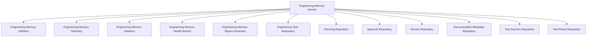

# Engineering Memory Architecture

## 1. Overview
The Engineering Memory subsystem provides a durable, transactional layer for storing, retrieving, and analyzing all metadata related to engineering activities in the Personal AI OS. It ensures all plans, tasks, approvals, quality reviews, test sessions, test results, and documentation index references are tracked safely and systematically.

## 2. Core Components
The subsystem is composed of 7 specialized repositories and 6 supporting services:

### Repositories
1. **EngineeringTaskRepository**: Stores individual dev tasks (id, description, status, phase, assigned agent, creation/update times).
2. **PlanningRepository**: Persists development execution plans, architectural decisions, and dependency graphs.
3. **ApprovalRepository**: Persists active quality gate gatekeeping sessions.
4. **ReviewRepository**: Persists finalized review decision records and historical state transitions.
5. **DocumentationMetadataRepository**: Tracks generated documentation file hashes, generation time, and location.
6. **TestSessionRepository**: Tracks runs of test suites, success percentages, and duration.
7. **TestResultRepository**: Stores granular test target outcomes (pytest results, error logs, and metrics).

### Coordinating & Helper Services
- **EngineeringMemoryService**: Coordinates writes/reads across all repositories, validating entities before saving them.
- **EngineeringMemoryValidator**: Validates schema compliance for all persisted items.
- **EngineeringMemoryTelemetry**: Records query latencies, success rates, and operation counts.
- **EngineeringMemoryStatistics**: Compiles usage counts and repository status statistics.
- **EngineeringMemoryHealthMonitor**: Evaluates database connectivity and migration status.
- **EngineeringMemoryReportGenerator**: Assembles HTML/Markdown status reports.

## 3. Data Integrity & Policies
All operations return `PersistenceResult` objects. In `STRICT` mode, any validation or write failures raise immediate exceptions to guarantee transactional consistency and prevent silent corruption.
In `BEST_EFFORT` mode, operations log warnings and attempt in-memory fallbacks when database issues occur.
