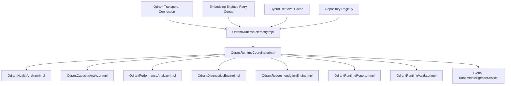

# Qdrant Runtime Intelligence Architecture

This document describes the design and components of the Qdrant Runtime Intelligence Platform in the Personal AI OS.

---

## 1. Architectural Overview

The Qdrant Runtime Intelligence Platform acts as the self-observing diagnostic overlay for the monorepo vector persistence system. It aggregates metrics from the underlying transport layer, semantic search engine, embedding queue, and cache manager.

---

## 2. Platform Core Services

* **QdrantRuntimeTelemetry**: Acts as the data ingress interface, pulling statistics from all vector database and embedding services.
* **QdrantHealthAnalyzer**: Evaluates component health scores (0-100) and maps overall health status (Healthy, Degraded, Critical).
* **QdrantCapacityAnalyzer**: Forecasts vector database growths, tracking payloads, memory limits, and pending index backlogs.
* **QdrantPerformanceAnalyzer**: Captures operations throughput and measures query latencies percentiles (P50, P95, P99).
* **QdrantDiagnosticsEngine**: Automatically monitors runtime metrics and registers alarms (e.g. slow query warnings).
* **QdrantRecommendationEngine**: Formulates tuning advises for caching, ranking weights, HNSW construction, and cluster sizing.
* **QdrantRuntimeReporter**: Renders structured Markdown status logs.
* **QdrantRuntimeValidator**: Evaluates schema formats of telemetry packages.
* **QdrantRuntimeCoordinator**: Central conductor exposing getters and links the platform back into the global monorepo dashboard.
