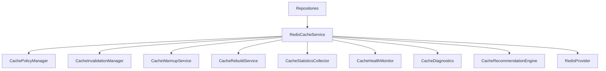

# Runtime Cache Platform Architecture (Sprint 5 Milestone 2)

This document outlines the architecture, design policies, and integration plan for the **Runtime Cache Platform** in the Personal AI OS.

## 1. System Overview
The Runtime Cache Platform extends the existing Redis Platform to provide high-performance runtime acceleration for database operations. PostgreSQL remains the persistent source of truth, while Redis accelerates critical read-paths. If Redis is unavailable, the application gracefully degrades to run queries directly against PostgreSQL.

## 2. Keyspace Design
All cache keys strictly follow the version-prefixed, colon-delimited naming standard:
`aios:v1:<workspace>:<project>:<subsystem>:<entity>:<purpose>`

| Subsystem | Key Pattern | Purpose / Entity | Default TTL |
| :--- | :--- | :--- | :--- |
| `workspace` | `aios:v1:{workspace_id}:default_project:workspace:{workspace_id}:cache` | Workspace metadata lookup | 10 minutes |
| `profile` | `aios:v1:default_workspace:default_project:profile:{profile_id}:cache` | Engineering Profile lookup | 30 minutes |
| `provider_capabilities` | `aios:v1:default_workspace:default_project:provider_capabilities:{capability_id}:cache` | Provider capability metadata | 15 minutes |
| `provider_health` | `aios:v1:default_workspace:default_project:provider_health:{health_id}:cache` | Provider health state | 30 seconds |
| `provider_routing` | `aios:v1:default_workspace:default_project:provider_routing:{routing_id}:cache` | Provider routing metadata | 15 minutes |
| `configuration` | `aios:v1:default_workspace:default_project:configuration:{config_id}:cache` | Configuration lookups | 60 minutes |

## 3. Cache Policies
Four explicit caching policies are supported:
1. **READ_THROUGH**: Automatically attempts to fetch from Redis. On miss, executes database callback, writes the result to Redis with the configured TTL, and returns the result.
2. **WRITE_THROUGH**: During writes, saves the record to PostgreSQL first, then updates the cache key in Redis before returning.
3. **CACHE_ASIDE**: During reads, fetches from cache if present; otherwise fetches from database and populates cache (lazy population). During writes, invalidates the cache key.
4. **NO_CACHE**: Bypasses the cache entirely and reads/writes directly to PostgreSQL.

## 4. Graceful Fallback & Incremental Rebuilding
If Redis disconnects or is unavailable:
1. The low-level `RedisTransportImpl` automatically redirects operations to the local, in-memory `FakeRedisClient` or handles exceptions gracefully.
2. The application continues execution normally by reading from PostgreSQL.
3. `CacheRebuildService` monitors the connectivity of Redis. Upon reconnection, it schedules incremental cache rebuilding of hot entries (active workspace, active engineering profile) in the background.

## 5. Integration with Runtime Intelligence
All operations (hits, misses, latencies, invalidations) log telemetry to `CacheStatisticsCollector`. This data is exposed to `RuntimeIntelligenceService` and is compiled in the operational reports.
