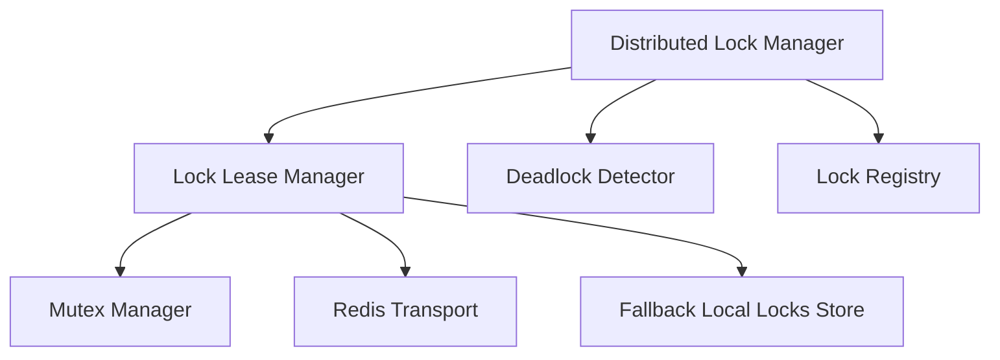

# Redis Distributed Coordination Platform Architecture

This document describes the architectural design of the **Redis Distributed Coordination Platform (Sprint 5 Milestone 4)**.

---

## 1. Architectural Overview

The Distributed Coordination Platform manages distributed locks, mutual exclusion, wait graphs, and lease renewals across Personal AI OS execution engines. Redis coordinates runtime locking while PostgreSQL remains the permanent source of truth for business metadata.

---

## 2. Lock Ownership Registry

Lock configurations are registered centrally in the `LockRegistry`. Each lock configuration maps to an owner service, a dedicated keyspace prefix, custom lease durations, heartbeats, and recovery rules:
- **workspace**: EXCLUSIVE, 60s lease, 10s timeout.
- **workflow**: EXCLUSIVE, 120s lease, 30s timeout.
- **automation**: EXCLUSIVE, 30s lease, 5s timeout.
- **provider**: SHARED, 15s lease, 2s timeout.
- **engineering**: REENTRANT, 300s lease, 60s timeout.
- **configuration**: EXCLUSIVE, 60s lease, 10s timeout.
- **temporary_execution**: LEASE, 10s lease, 1s timeout.

---

## 3. Lock Policies & Lifecycle Management

The platform supports four explicit lock policies:
1. **EXCLUSIVE**: Standard single-owner mutex.
2. **SHARED**: Multi-owner read-lock.
3. **REENTRANT**: Re-acquired by the same owner without self-deadlocking (tracks internal reentrancy count).
4. **LEASE**: Time-bound, sliding expiration lock with active heartbeat renewals.

---

## 4. Deadlock Detection

`DeadlockDetector` maintains a Directed Wait Graph mapping waiting nodes (`owner_id`) to nodes holding their requested locks. A cycle detection algorithm runs periodically:
- **Cycle Identification**: Runs DFS to locate circular dependencies.
- **Remediation**: Exposes recommendations recommending `force_release` on specific locks to safely resolve cycles without terminating the main process.

---

## 5. Grace Fallback

In the event of a Redis outage:
- Connection drops are caught by the `LockLeaseManagerImpl` using direct transport execute routing.
- The manager degrades to local thread-safe in-memory dictionaries (`self._local_locks`).
- Lock acquisitions, renewals, and releases are executed locally, ensuring zero-downtime execution.
