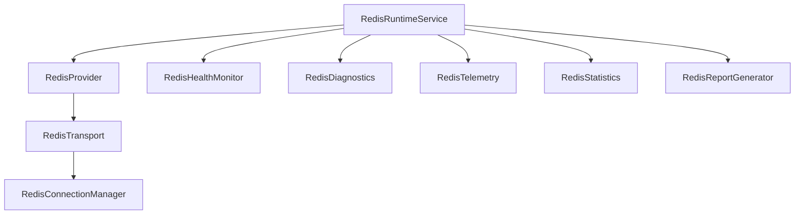

# Redis Platform Architecture

This document describes the design and implementation of the Redis Platform in the Personal AI OS Persistence layer.

## 1. System Overview

The Redis Platform provides high-performance runtime acceleration. While PostgreSQL remains the system of record for all permanent metadata, Redis stores ephemeral state, read-through lookup caches, dialogue sessions, rate limit counters, and delayed task queues.

## 2. Core Components

1. **RedisConfigurationService**: Houses environment parameter bindings (`REDIS_HOST`, `REDIS_PORT`, `REDIS_USERNAME`, `REDIS_PASSWORD`, `REDIS_DATABASE`, `REDIS_TLS`, `REDIS_TIMEOUT`, `REDIS_MAX_CONNECTIONS`). Sets `awaiting_configuration` if configuration parameters are missing.
2. **RedisConnectionManager**: Controls lifecycle connections, fallback allocations to a local in-memory simulated cache (`FakeRedisClient`) when offline or lacking libraries, and connection retry states.
3. **RedisTransport**: Exposes low-level command routing via `.execute_command()`. Logs command execution latencies to the central `RuntimeIntelligenceService`.
4. **RedisProvider**: Provides key-value operations (`get`, `set`, `delete`, `exists`).
5. **RedisRuntimeService**: Main coordinating orchestrator, implementing `ServiceLifecycle`.
6. **RedisValidator**: Validates keys against the keyspace standard.
7. **RedisReportGenerator**: Renders markdown dashboards of status and health to `docs/persistence/`.

## 3. Keyspace Standard

All Redis keys must strictly conform to the colon-delimited version-prefixed naming hierarchy:

`aios:v1:<workspace>:<project>:<subsystem>:<entity>:<purpose>`

### Standard Fields:
- `workspace`: Active workspace ID.
- `project`: Active project ID.
- `subsystem`: Target subsystem (e.g. `dialogue`, `provider`, `workspace`).
- `entity`: Identifier for the entity (e.g. `session_123`, `openai`).
- `purpose`: Exact context (e.g. `lock`, `cache`, `rate_limit`).

## 4. Ephemeral-Only Policy

Under the AI OS Engineering Constitution, Redis stores only temporary data. Persistent workspace entries, workflow graphs, task logs, prompts, responses, secrets, and generated code must **never** be saved in Redis.

## 5. Graceful Fallback Strategy

To ensure high availability, if Redis becomes offline or fails:
1. Connection drops are caught by the Connection Manager.
2. The transport gracefully falls back to using the local, in-memory `FakeRedisClient`.
3. The platform logs degraded health warnings in diagnostics, while executing operations normally, guaranteeing zero loss of functionality.
