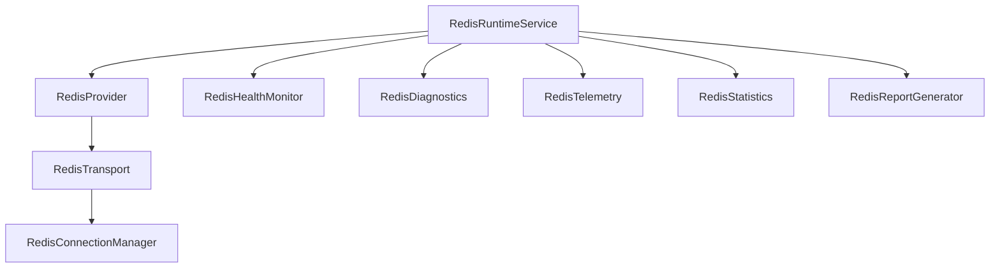

# Redis Platform Architecture Discovery Report

This report outlines the proposed architecture, keyspace design, integration strategies, and production certification plans for the Redis Platform in Sprint 5 of the Personal AI OS.

---

## 1. Executive Architecture Summary

The Redis Platform acts as the **runtime acceleration layer** for the Personal AI OS. It handles ephemeral runtime state, low-latency caches, distributed locking, queues, and rate-limiting. 

PostgreSQL remains the **permanent source of truth** and the sole system of record. Redis does not store any permanent metadata. If the Redis keyspace is cleared or the service becomes unavailable, the AI OS degrades gracefully to PostgreSQL and is capable of rebuilding all temporary cache structures dynamically.

---

## 2. Existing Component Analysis

The Persistence Platform architecture establishes a strict separation of concerns via the **Provider → Transport** pattern:
- **Dependency Container & DI**: `bootstrap.py` configures services implementing `ServiceLifecycle`.
- **Active Providers**: `PersistenceServiceImpl` orchestrates SQL queries by delegating to `PostgreSQLProvider` which wraps a concrete `DatabaseTransport`.
- **Subsystem Telemetry**: Subsystems use cached repositories (`AIUsageStatisticsRepository`, etc.) that implement read-through/write-through behaviors.
- **Runtime Intelligence**: Intercepts query execution to monitor connection health and compute latency distributions.

We will reuse this structure by introducing parallel Redis-specific providers, transports, and config controllers.

---

## 3. Redis Responsibility Boundaries

| Feature | Redis Responsibility | PostgreSQL Responsibility |
| :--- | :--- | :--- |
| **Workspace State** | Ephemeral locks, active cursor/edit leases | Permanent workspace entities, historical branches |
| **Session Cache** | Active execution state, temporary dialogue histories | Persisted session checkpoints, resumes, and logs |
| **Telemetry & Stats** | Live rate counters, sliding window execution metrics | Historical provider statistics and monthly usage logs |
| **Queues** | Real-time task, retry, and delayed job queues | Persistent task lists and outcome records |

---

## 4. Runtime Data Classification

- **Read-Through Caches**: Ephemeral lookup state (e.g. AI provider capabilities, configurations).
- **Session Caches**: High-frequency dialogue contexts and context histories.
- **Distributed Locks**: Mutexes for concurrent developer operations and provider quota blocks.
- **Rate Limit Counters**: Sliding-window counts for workspace APIs and AI models.
- **Ephemeral Job Queues**: Delayed retry queues for automated background workflows.

---

## 5. Provider → Transport Architecture

We will implement a parallel transport system matching Sprint 4's PostgreSQL infrastructure:

- **RedisConfigurationService**: Holds connections, timeouts, retry configurations, and TTL defaults.
- **RedisTransport**: Low-level wrapper around the Python `redis` client.
- **RedisConnectionManager**: Manages pool connections and handles retry-backoff connection loops.
- **RedisProvider**: Exposes basic Redis commands (GET, SET, DEL, EXPIRE, EVAL).
- **RedisRuntimeService**: Coordinating orchestrator exposing higher-level API patterns (caching, lock acquisition, rate limiting, and queues).

---

## 6. Dependency Injection Strategy

- **Registration**: All Redis components will inherit from `ServiceLifecycle` and be registered inside `bootstrap.py` alongside the main database components.
- **Decoupling**: Repositories will resolve `RedisRuntimeService` from the DI registry to execute cached lookups.

---

## 7. Cache Architecture

- **Read-Through Caching**:
  1. Repository checks Redis for a key.
  2. If found, returns it.
  3. If missing, loads it from PostgreSQL, writes it to Redis with a default TTL, and returns.
- **Write-Through Caching**:
  1. Repository writes to PostgreSQL.
  2. If successful, writes/invalidates the key in Redis.
- **Eviction Strategy**: Enforce standard `volatile-lru` (Least Recently Used with TTL expiry) within Redis configuration.
- **Cache Warming**: Periodically warm AI Provider capability tables on system boot.

---

## 8. Session Architecture

- **AI OS Session Types**: AI Dialogue, Workspace, Workflow Execution, Provider API, and Developer Sessions.
- **Expiration Policy**: Set standard session TTLs (e.g., 2 hours). Sessions are periodically touched to slide the expiration window.
- **Recovery Plan**: On session cache loss, reload session metadata from PostgreSQL and resume execution.

---

## 9. Distributed Lock Architecture

- **Algorithm**: Implement Redlock-compliant single-instance Mutexes using `SETNX` (set-if-not-exists) with value-owned lease tokens.
- **Safety**:
  - **Lease Management**: Enforce maximum lease durations (e.g. 30 seconds).
  - **Deadlock Prevention**: Automatic release via Redis-enforced TTLs.
  - **Reentrancy**: Track lock ownership tokens to prevent double-locking.
- **Subsystem Locks**: Enforce locks on Workspace edits, Automation script tasks, and AI Provider quota allocations.

---

## 10. Queue Architecture

- **Job Queue**: Utilizes Redis Sorted Sets (`ZSET`) and List primitives (`LPUSH`, `BRPOP`) for queue management.
- **Retry Queue**: Employs delayed retries with exponential backoffs.
- **delayed Queue**: Employs Sorted Sets where the score represents the execution epoch timestamp.
- **Priority Queue**: Uses multiple lists segmented by priority or weighted score evaluation.

---

## 11. Rate Limiting Architecture

- **Algorithm**: Sliding window counter implemented using a Redis transaction (`MULTI` / `EXEC`) executing:
  1. `ZADD` (add current epoch time).
  2. `ZREMRANGEBYSCORE` (remove old elements outside the window).
  3. `ZCARD` (retrieve current volume count).
- **Quota Sync**: Sync local usage statistics to PostgreSQL `ai_usage_statistics` periodically.

---

## 12. Keyspace Design

To prevent key collisions and organize data, we propose a strict, colon-delimited hierarchical naming convention:

`aios:<workspace_id>:<project_id>:<subsystem>:<entity_type>:<entity_id>:<purpose>`

### Examples:
- **Locking**: `aios:default:proj1:workspace:lock:edit_lease`
- **Session Cache**: `aios:default:proj1:dialogue:session:sess_123:context`
- **Rate Limiting**: `aios:default:global:provider:rate_limit:openai:counter`
- **Read-Through Cache**: `aios:default:global:ai_memory:cache:provider_capabilities`

---

## 13. Failure Recovery Strategy

- **Graceful Degradation**: If Redis connection is lost, all reads fallback to executing directly against PostgreSQL, and all write locks degrade to internal thread-locks.
- **Auto-Reconnect**: The connection manager retries with exponential backoff.
- **Rebuild Flow**: Upon reconnect, invalidate caches and trigger lazy-warming.

---

## 14. Runtime Observability Design

- **Health Checks**: Ping latencies, memory footprint ratios, and eviction rates.
- **Diagnostics**: Auto-diagnosis of timeout, pool exhaustion, and connection loss states.
- **Integration**: Feed all Redis latency and capacity statistics back into the Sprint 4 `RuntimeIntelligenceService` consumer.

---

## 15. Engineering Learning Preparation

The `RedisRuntimeService` will expose `.get_redis_observability_payload()` returning:
- Cache hit/miss trends.
- Lock collision metrics and lease durations.
- Queue backlog volumes.
- Connection retry histories.

---

## 16. Production Certification Plan

To validate Sprint 5, we plan to execute:
1. **Architecture Discovery Report**: (Current phase) Review of core interfaces and keyspace design.
2. **Implementation Phase**: Write concrete services, providers, and DI registrations.
3. **Mock & Unit Testing**: Test full cache hit/miss pathways, delayed queues, and locking reentrancy.
4. **Failure Injection**: Inject connection drops, pool starvation, and eviction limits to verify PostgreSQL recovery logic.
5. **Live Production Certification**: Validate Redis connection handling and compute baseline cache latencies.

---

## 17. Architecture Decision Records (ADR)

### ADR 5.1: Ephemeral State Storage
- **Context**: The AI OS requires low-latency distributed locks and execution caches.
- **Decision**: Introduce Redis strictly as an ephemeral caching and coordination layer. PostgreSQL remains the permanent system of record.
- **Rationale**: Isolates memory corruption or server crashes from permanent business metadata.

---

## 18. Risks & Technical Considerations

- **Keyspace Bloat**: Unchecked session histories can consume substantial memory. *Mitigation*: Enforce default 24-hour TTLs on all session keys.
- **Cache Invalidation Mismatch**: If PostgreSQL updates fail to invalidate Redis keys, dirty reads will occur. *Mitigation*: Implement strict write-through policies inside repository implementations.
