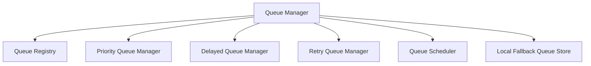

# Redis Queue Platform Architecture

This document describes the architectural design of the **Redis Queue Platform (Sprint 5 Milestone 5)**.

---

## 1. Architectural Overview

The Queue Platform manages job scheduling, execution coordination, priorities, backoffs, visibility timeouts, and worker coordination across Personal AI OS execution engines. Redis owns runtime scheduling, while PostgreSQL remains the permanent source of truth.

---

## 2. Queue Ownership Registry

Queue parameters are registered centrally in the `QueueRegistry`. Default configurations declare owner services, worker types, concurrency limits, and retry strategies:
- **engineering**: Priority NORMAL, 3 max retries, exponential delay,visibility 30s.
- **automation**: Priority HIGH, 5 max retries, fixed delay, visibility 15s.
- **workflow**: Priority NORMAL, 3 max retries, exponential delay, visibility 60s.
- **ai_provider**: Priority CRITICAL, 2 max retries, immediate delay, visibility 10s.
- **workspace**: Priority NORMAL, 3 max retries, exponential delay, visibility 30s.
- **background_maintenance**: Priority BACKGROUND, 1 max retry, fixed delay, visibility 120s.
- **runtime_validation**: Priority HIGH, 3 max retries, exponential delay, visibility 15s.

---

## 3. Retries & Dead-letter Queues (DLQ)

If a job fails:
- `RetryQueueManager` evaluates the retry count against configured limits.
- If below the limit, the job status is set back to `pending`, and the target execution time is updated using fixed delays or exponential backoff ($delay \times 2^{\text{retries}}$).
- Once the retry limit is exceeded, the job is moved to the configured **Dead-letter Queue (DLQ)** with status `dlq` to prevent infinite looping or silent failures.

---

## 4. Grace Fallback

If Redis becomes unavailable:
- Enqueuing, dequeuing, cancellations, and heartbeats catch transport exceptions and degrade immediately to thread-safe local in-memory dictionaries (`self._local_queues`).
- Delayed scheduling and priority sorting run locally inside memory buffers.
- Once Redis returns, execution resume strategies allow workers to dynamically re-synchronize pending local items back to Redis.
