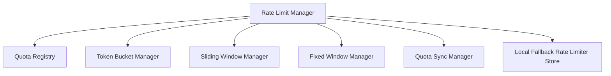

# Redis Rate Limiting Platform Architecture

This document describes the architectural design of the **Redis Rate Limiting Platform (Sprint 5 Milestone 6)**.

---

## 1. Architectural Overview

The Rate Limiting Platform provides distributed quota enforcement and rate limiting capabilities across all execution paths. Redis serves as the runtime quota controller, while PostgreSQL serves as the permanent registry configuration source and usage stats database.

---

## 2. Quota Ownership Registry

Quota allocations are managed centrally in the `QuotaRegistry`. Default configurations declare capacity ceilings, window durations, sync policies, and algorithm choices:
- **ai_provider**: Token Bucket, capacity 10, refill 2.0/s, conservative fallback.
- **workspace**: Sliding Window, capacity 100, window 60s, conservative fallback.
- **project**: Fixed Window, capacity 500, window 3600s, conservative fallback.
- **automation**: Token Bucket, capacity 20, refill 5.0/s, conservative fallback.
- **workflow**: Token Bucket, capacity 50, refill 10.0/s, conservative fallback.
- **engineering**: Fixed Window, capacity 1000, window 3600s, conservative fallback.
- **runtime_validation**: Sliding Window, capacity 30, window 60s, conservative fallback.

---

## 3. Quota Enforcement Algorithms

1. **Token Bucket**: Regulates sliding execution flows using refill calculations ($elapsed \times refill\_rate$) bounded by burst capacity limits.
2. **Sliding Window**: Binds execution to a sliding timeframe, maintaining sorted timestamp indices and filtering expired request instances.
3. **Fixed Window**: Tracks request increments inside fixed-size temporal boundaries, resetting counts on boundary expiration.

---

## 4. safe Grace Fallback

In the event of a Redis outage:
- Connection errors are caught immediately by the `RateLimitManagerImpl`.
- The rate limiter degrades gracefully to local thread-safe dictionaries (`self._local_quotas`).
- **Never allow unlimited execution**: Under fallback, the system restricts local capacities and refill rates to **50%** of their registered limits, ensuring safe, throttled execution even in offline mode.
