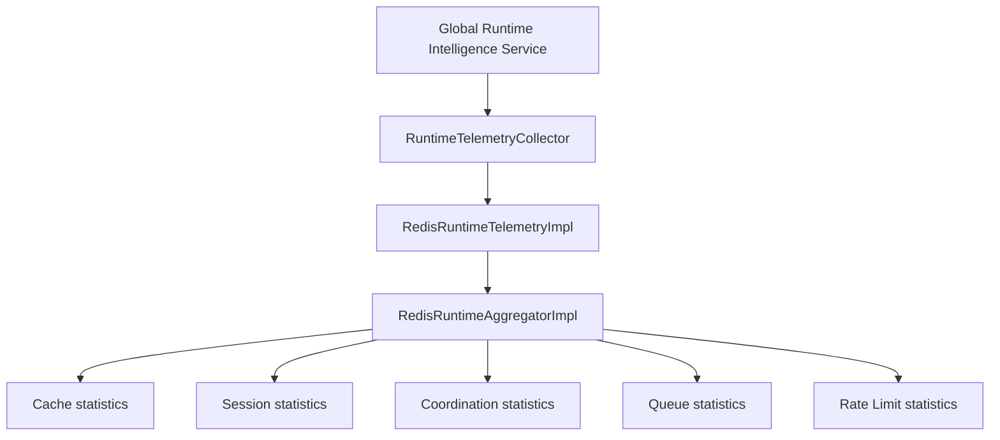

# Redis Runtime Intelligence Platform Architecture

This document describes the architectural layout of the **Redis Runtime Intelligence Platform (Sprint 5 Milestone 7)**.

---

## 1. Architectural Overview

The Redis Runtime Intelligence Platform observes the local Redis operations and integrates with all existing Redis subsystems (Cache, Session, Distributed Coordination, Queue, and Rate Limiting) to compile unified telemetry. It acts as an extension producer that feeds directly into the global Runtime Intelligence Platform.

---

## 2. Integrated Services & Metrics Gathering

- **RedisRuntimeTelemetry**: Collects latencies, connection states, and rates.
- **RedisRuntimeAggregator**: Merges stats across the 5 subsystems.
- **RedisRuntimeHealthAnalyzer**: Computes sub-health indexes and overall health scores.
- **RedisCapacityAnalyzer**: Evaluates lock contention, queue depth, and memory thresholds.
- **RedisPerformanceAnalyzer**: Evaluates command latencies and throughput metrics.
- **RedisRecommendationEngine**: Provides actionable optimization suggestions without mutating live settings.
- **RedisRuntimeDiagnostics**: Identifies, logs, and ranks anomalies and failures.
- **RedisRuntimeStatisticsCollector**: Prepares metrics for historical storage.
- **RedisRuntimeReporter**: Formats diagnostics into human-readable markdown summaries.
- **RedisRuntimeValidator**: Assures telemetry compliance.

---

## 3. Global Integration Strategy

The Redis Runtime Intelligence Platform registers as a sub-collector on the global `RuntimeTelemetryCollector` via `ri_telem.redis_telemetry = redis_intelligence_service`.
When global metrics are requested, the payload is dynamically enriched under the `"redis_telemetry"` key, and overall scores (health, performance, capacity) merge cleanly, preserving backward compatibility.
