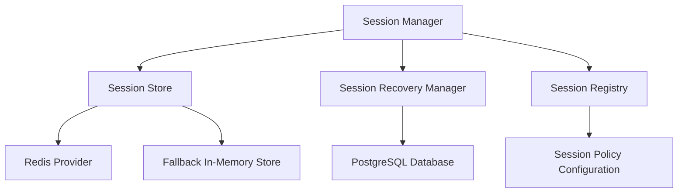

# Redis Session Platform Architecture

This document describes the architectural design of the **Redis Session Platform (Sprint 5 Milestone 3)**.

---

## 1. Architectural Overview

The Redis Session Platform manages temporary runtime session states across the Personal AI OS monorepo. While PostgreSQL remains the permanent source of truth for durable entities, Redis acts as the high-speed cache/store for transient sessions (e.g. workspace contexts, AI dialogue loops, workflow run traces).

---

## 2. Centralized Session Ownership Registry

The `SessionRegistry` coordinates configurations for each session type:
- **ai**: Ephemeral (3600s TTL, Heartbeat required).
- **workspace**: Persistent Reference (86400s TTL, Backed by database).
- **workflow**: Recoverable (7200s TTL, Heartbeat required, Database reconstructable).
- **provider**: Ephemeral (1800s TTL, Heartbeat required).
- **engineering**: Persistent Reference (14400s TTL, Backed by database).
- **automation**: Recoverable (3600s TTL, Heartbeat required, Database reconstructable).
- **temporary_execution**: Ephemeral (900s TTL).
- **runtime_validation**: Ephemeral (600s TTL).

---

## 3. Session Policies

We support three explicit policy strategies:
1. **EPHEMERAL**:
   - *Behavior*: Session exists only in memory/Redis. Natural expiration deletes the session.
   - *Recovery*: Outages result in session loss; clients recreate them.
2. **RECOVERABLE**:
   - *Behavior*: Session resides in Redis. Expirations trigger evictions.
   - *Recovery*: Outages trigger recovery handlers that reconstruct the session state.
3. **PERSISTENT_REFERENCE**:
   - *Behavior*: Session maps to a PostgreSQL database record.
   - *Recovery*: Outages fallback directly to read/write columns in PostgreSQL.

---

## 4. Keyspace Naming Standard

Keyspace formatting follows a strict colon-delimited structure:
`aios:v1:<workspace>:<project>:session:<type>:<session_id>`

Metadata including Workspace ID, Project ID, Session Type, Creation Time, and TTL are serializable inside the stored payload.

---

## 5. Resilient Fallback Mechanics

If Redis is unreachable (connection timeout, socket drop, etc.):
- The system automatically redirects read/write operations to a local in-memory dict fallback store.
- Re-establishment of connection triggers `SessionRecoveryManager` to incrementally rebuild recoverable states.
- Session failures never cause permanent database data loss.
