# Runtime Intelligence Architecture

This document describes the design and implementation of the Runtime Intelligence Platform for the Personal AI OS Persistence layer.

## 1. System Overview

The Runtime Intelligence Platform shifts the focus of the persistence layer from static storage to active, runtime observability. It provides unified metrics collection, latency percentile computation (P50, P95, P99), connection pool diagnostics, nested transaction monitoring, and structured recommendation logs.

```mermaid
graph TD
    RIS[RuntimeIntelligenceService] --> HM[RuntimeHealthMonitor]
    RIS --> TC[RuntimeTelemetryCollector]
    RIS --> SE[RuntimeStatisticsEngine]
    RIS --> DE[RuntimeDiagnosticsEngine]
    RIS --> CA[RuntimeCapacityAnalyzer]
    RIS --> RE[RuntimeRecommendationEngine]
    RIS --> PA[RuntimePerformanceAnalyzer]
    RIS --> QP[RuntimeQueryProfiler]
    RIS --> TP[RuntimeTransactionProfiler]
    RIS --> RP[RuntimeRepositoryProfiler]
    RIS --> LM[RuntimeLifecycleMonitor]
    RIS --> CM[RuntimeCorrelationManager]
    RIS --> RG[RuntimeReportGenerator]
```

## 2. Core Components

1. **RuntimeCorrelationManager**: Manages thread-local transaction context. Injects `CorrelationID`, `WorkspaceID`, `ProjectID`, `Repository`, and `Operation` to trace execution flows without modifying Repository APIs.
2. **RuntimeTelemetryCollector**: Cumulative and sliding window collector for queries recorded, failures, and retries.
3. **RuntimePerformanceAnalyzer**: Computes latency distributions (P50, P95, P99) and averages.
4. **RuntimeStatisticsEngine**: Tracks transaction success counts, policy distribution, and read-through/write-through cache hits/misses.
5. **RuntimeDiagnosticsEngine**: Aggregates execution errors, classifying them by severity (`INFO`, `WARNING`, `ERROR`, `CRITICAL`), mapping each to structured remediations.
6. **RuntimeCapacityAnalyzer**: Computes pool utilization rates and assesses connection starvation risks.
7. **RuntimeQueryProfiler**: Tracks slow SQL execution statements (>100ms threshold).
8. **RuntimeTransactionProfiler**: Monitors transaction durations and tracks nested transaction depth (`tx_depth`).
9. **RuntimeRepositoryProfiler**: Profiles repository execution frequencies (throughput) and latency per table.
10. **RuntimeLifecycleMonitor**: Measures boot durations, database migration history, and provider hot swaps.
11. **RuntimeRecommendationEngine**: Generates automated tuning recommendations based on observed metrics (Performance, Reliability, Capacity, Maintenance).
12. **RuntimeHealthMonitor**: Evaluates database server connection status, transport health, and query availability percentages.
13. **RuntimeReportGenerator**: Compiles observability states into static Markdown reports in `docs/persistence/`.
14. **RuntimeIntelligenceService**: The orchestrator implementing `ServiceLifecycle`, providing a single entry point for all components.

## 3. Data Integration Flow

1. **Context Init**: Every Repository call invokes `PersistenceService.check_status(repo, operation)`.
2. **Correlation Context**: `RuntimeCorrelationManager` automatically generates a `CorrelationID` and registers the workspace/project details in thread-local storage.
3. **SQL Interception**: `PersistenceServiceImpl.execute(...)` interceptor profiles SQL latency, logging outcomes, slow queries, and table utilization.
4. **Cache Metrics**: Read-through and write-through cache repositories report hits/misses directly to the statistics engine.
5. **Telemetry Aggregation**: Individual subdomains (Workspace, Engineering Memory, Automation, AI Memory) continue to log telemetry, forwarding all metrics to the central collector.
6. **Self-Monitoring**: The health monitor and recommendation engines compile metrics, writing markdown dashboards via the report generator.
