# Runtime Intelligence Architecture Discovery Report

This report presents the discovery findings, duplication audits, and architectural plans for Sprint 4 Milestone 6 (Runtime Intelligence) of the Personal AI OS.

## 1. Executive Summary

As the Persistence Platform scales from a simple workspace store to a multi-domain transactional platform (covering Workspace, Engineering Memory, Automation, and AI Memory), it requires self-monitoring, correlation tracing, and performance profiling.

Runtime Intelligence shifts the focus from **storage** to **observability**. It aims to unify fragmented telemetry, diagnostics, and metrics compilers into a unified Runtime Intelligence Service.

---

## 2. Current State Analysis

An audit of the repository reveals multiple fragmented components handling telemetry, diagnostics, and reporting:

### 2.1 Health Monitors
- `PersistenceHealthMonitor`: Evaluates active provider and database transport connectivity.
- `EngineeringMemoryHealthMonitor`: Tracks active query status for engineering tables.
- `AutomationPersistenceHealthMonitor`: Evaluates automation tables state.
- `AIMemoryHealthMonitor`: Evaluates availability ratings for AI providers.

### 2.2 Telemetry Systems
- `WorkspacePersistenceTelemetry`: Records transaction latency.
- `EngineeringMemoryTelemetry`: Tracks queries recorded and failed.
- `AutomationPersistenceTelemetry`: Logs latency details for automation execution.
- `AIMemoryTelemetry`: Monitors validation and transaction queries latencies.

### 2.3 Diagnostics & Statistics
- `PersistenceDiagnostics`: Generates remediation plans for configuration mismatches.
- `WorkspacePersistenceStatistics`, `EngineeringMemoryStatistics`, `AutomationPersistenceStatistics`, `AIMemoryStatistics`: Independently compile row totals by executing count queries.

### 2.4 Report Generators
- Separate report generators exist for Workspace, Engineering Memory, Automation, and AI Memory. Each writes static markdown files to `docs/persistence/` or `docs/providers/`.

---

## 3. Duplication & Redundancy Audit

- **Mismatched Counting Logic**: Every subdomain statistics class queries `SELECT COUNT(*)` on its respective tables. This is repeated across 4 domains.
- **Redundant Telemetry Fields**: Running average latency and error count trackers are re-implemented across 4 distinct classes.
- **Reporting Bloat**: Multiple markdown reports are compiled separately. A unified report generator should compile a single live dashboard.

---

## 4. Reusable Infrastructure

- **Database Transport Health**: `DatabaseTransport.health()` returns live connection states, latencies, and error messages.
- **Active Provider Metrics**: `active_provider.get_metrics()` compiles active connection counts, latencies, and applied migration metrics.
- **Service Lifecycle Interface**: The DI registry requires all services to implement `ServiceLifecycle`. The new intelligence components will reuse this interface.

---

## 5. Proposed Runtime Intelligence Architecture

We propose the following 14 components unified under a coordinating service `RuntimeIntelligenceService`:

```mermaid
graph TD
    RIS[RuntimeIntelligenceService] --> Health[RuntimeHealthMonitor]
    RIS --> Telem[RuntimeTelemetryCollector]
    RIS --> Stats[RuntimeStatisticsEngine]
    RIS --> Diag[RuntimeDiagnosticsEngine]
    RIS --> Capacity[RuntimeCapacityAnalyzer]
    RIS --> Recommend[RuntimeRecommendationEngine]
    RIS --> Perf[RuntimePerformanceAnalyzer]
    RIS --> QProf[RuntimeQueryProfiler]
    RIS --> TxProf[RuntimeTransactionProfiler]
    RIS --> RepoProf[RuntimeRepositoryProfiler]
    RIS --> Life[RuntimeLifecycleMonitor]
    RIS --> Corr[RuntimeCorrelationManager]
    RIS --> RepGen[RuntimeReportGenerator]
```

### 5.1 Detailed Component Specifications

1. **RuntimeHealthMonitor**: Consolidated live connectivity checks, availability percentage formulas, and circuit breaker evaluation.
2. **RuntimeTelemetryCollector**: Live collector for query latencies, failed queries count, pool usage statistics, and retry counts.
3. **RuntimeStatisticsEngine**: Computes query throughput, transaction success ratios, and cache hit/miss/read-through/write-through metrics.
4. **RuntimeDiagnosticsEngine**: Analyzes active database errors and matches them with actionable remediations.
5. **RuntimeCapacityAnalyzer**: Assesses connection starvation, pool usage limits, and table size projections.
6. **RuntimeRecommendationEngine**: Analyzes telemetry/profiler logs to generate structured warnings (e.g. slow queries, high retry rates, transaction bottlenecks).
7. **RuntimePerformanceAnalyzer**: Computes latency percentiles (P50, P95, P99) from sliding query latency windows.
8. **RuntimeQueryProfiler**: Profiles slow queries, tracking exact query strings, parameters, execution durations, and tables.
9. **RuntimeTransactionProfiler**: Monitors transaction durations, rollback events, and nested transaction usage (`tx_depth`).
10. **RuntimeRepositoryProfiler**: Monitors specific table access patterns (e.g., read vs write frequencies) to track utilization.
11. **RuntimeLifecycleMonitor**: Audits startup migrations, boot durations, and provider swap events.
12. **RuntimeCorrelationManager**: Manages thread-local or contextual correlation context.
13. **RuntimeReportGenerator**: Compiles diagnostics, statistics, and recommendations into standard diagnostic Markdown dashboards.
14. **RuntimeIntelligenceService**: The unified manager implementing `ServiceLifecycle` and providing a single entry point for all runtime observability.

---

## 6. Correlation ID Design

We will introduce a context-managed `RuntimeCorrelationManager` exposing:
- **Correlation ID**: Unique UUID for tracing operations.
- **Workspace ID**: Active workspace.
- **Project ID**: Active project.
- **Repository**: Target table name.
- **Operation**: `save`, `get`, `delete`, etc.
- **Timestamp**: Execution start time.
- **PersistenceResult**: Outcome payload and latency.

This correlation context will be stored in thread-local storage or context variables, allowing automatic correlation injection into query profiles and telemetry logs without changing public Repository APIs.

---

## 7. Learning Preparedness

To prepare for future Engineering Learning subsystems, the `RuntimeIntelligenceService` will expose a `.get_learning_payload()` method returning structured trends:
- Runtime, failure, performance, capacity, and health trends.
- Structured recommendation metadata and error summaries.
