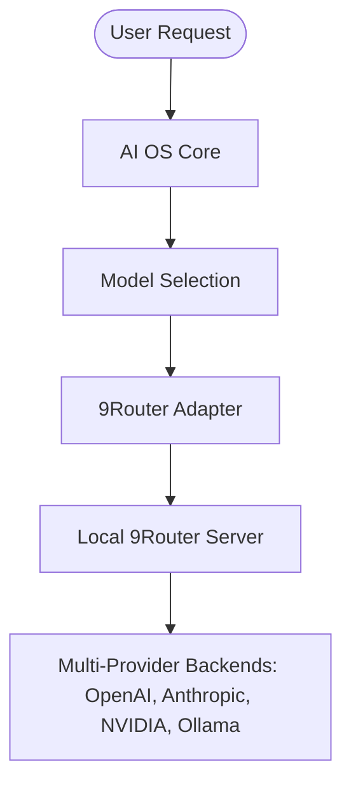

# 9Router Provider Gateway (OmniRoute 2.0)

This document outlines the architecture, setup, configuration, and command suite for the integration of 9Router as the primary provider gateway in AI OS.

---

## 1. Architecture Overview

In OmniRoute 2.0, provider routing, health monitoring, and client-side fallback loops are delegated to the local **9Router** server. AI OS retains responsibility for high-level tasks like intent understanding, prompt construction, context building, and canonical model selection.



- **AI OS Responsibilities**:
  - Intent understanding
  - Task planning
  - Context building
  - Memory integration
  - Prompt construction
  - Tool orchestration
  - Model selection (e.g., matching capability flags like coding, reasoning)

- **9Router Responsibilities**:
  - Provider routing
  - Provider fallback
  - Health monitoring
  - Quota management
  - OpenAI-compatible API serving

---

## 2. Configuration

All gateway settings are configured in `config/config.toml` under the `[llm.ninerouter]` section:

```toml
[llm.ninerouter]
base_url = "http://localhost:8080/v1"
api_key = "9router-api-key"
timeout = 30
preferred_model = "gpt-4o"
preferred_backend = "openai"
```

---

## 3. Dynamic Auto-Discovery

At startup, the dynamic discovery service polls the local 9Router server's `/models` endpoint to query all available models. 
Discovered models are parsed for capability flags (e.g., presence of `coder` implies `supports_coding = True`) and registered in the `universal_model_registry`.

If the 9Router server is offline, discovery falls back to the local cached configuration file `.aios_9router_cache.json` to ensure operational continuity.

---

## 4. CLI Subcommand Suite

The `aios providers` namespace exposes administrative and diagnostics tools:

| Command | Description |
| --- | --- |
| `aios providers status` | Displays connection state, URL, ping latency, and model count. |
| `aios providers models` | Lists all discovered/connected models and their capabilities. |
| `aios providers health` | Performs live endpoint ping latency checks. |
| `aios providers config` | Prints active gateway settings from `config.toml`. |
| `aios providers test` | Executes a test prompt completion to verify the API loop. |

---

## 5. Automated Reports

Every status update automatically updates the markdown reports in `docs/providers/`:
1. [local_gateway_status.md](file:///Users/anzarakhtar/aios/docs/providers/local_gateway_status.md)
2. [installed_providers.md](file:///Users/anzarakhtar/aios/docs/providers/installed_providers.md)
3. [connected_models.md](file:///Users/anzarakhtar/aios/docs/providers/connected_models.md)
4. [configuration_summary.md](file:///Users/anzarakhtar/aios/docs/providers/configuration_summary.md)
