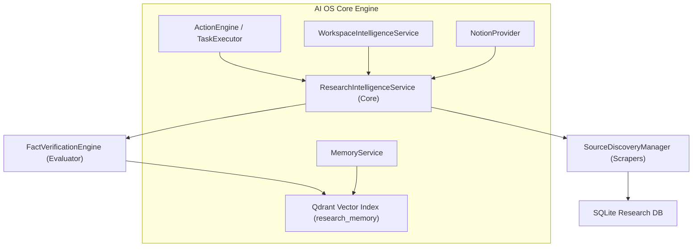

# Research Intelligence — Conceptual Vision & Product Framework
**Sprint 11 · Milestone 1 (Foundation)** · Version 1.0 · July 2026

---

## Document Metadata
* **Purpose**: Establish the core product vision, conceptual framework, and guiding principles of Research Intelligence.
* **Scope**: Governs all subsequent architectural and functional specifications of the Research module.
* **Audience**: Systems Architects, AI Developers, and the Owner.
* **Related Documents**:
  * [00_PROJECT_VISION.md](file:///Users/anzarakhtar/aios/docs/00_PROJECT_VISION.md) - Project Constitution.
  * [16_ENGINEERING_BIBLE.md](file:///Users/anzarakhtar/aios/docs/16_ENGINEERING_BIBLE.md) - Core system guidelines.
  * [research/README.md](file:///Users/anzarakhtar/aios/docs/research/README.md) - Navigation hub.

---

## 1. Executive Summary & Core Paradigm

The **Research Intelligence** module is the subsystem that enables the **Personal AI OS** to acquire, organize, validate, and reason over technical knowledge. 

Traditional AI research assistants are cloud-hosted services that accept a query, browse the web, and output raw markdown summaries. Under the Personal AI OS paradigm, research is localized, structured, and deeply integrated into the local development context. The AI OS serves as the reasoning and execution core, treating retrieved web documents, RFC files, and API specs as structured, verified inputs for local databases.

```
+------------------------------------------+       +------------------------------------------+
|          PERSONAL AI OS (Cognitive Core)  |       |        TECHNICAL KNOWLEDGE (External)    |
|                                          |       |                                          |
|  - Reasoning & Fact Verification         |       |  - API Docs & Specifications             |
|  - Local Knowledge Catalog (SQLite)      | <===> |  - Standard RFCs & Academic Papers       |
|  - Semantic Search Cache (Qdrant)        |       |  - Developer Blogs & Technical Forums    |
|  - Local-first LLMs & Tools Orchestrator |       |  - Version Control Issues & Repositories |
+------------------------------------------+       +------------------------------------------+
```

* **The Web is the Source**: It contains documentation, specs, papers, and forum discussions.
* **Personal AI OS is the Cognator**: It acts as the local controller that fetches resources, strips advertisements, converts HTML to clean markdown, indexes symbols semantically, validates facts, and caches literature.

---

## 2. Why Research Intelligence?

Autonomous software engineering requires reasoning over APIs and documentation that may not have been present in the model's training data.
1. **Dynamic API Updates**: Cloud library versions and APIs change rapidly. The AI OS must dynamically pull and parse the latest documentation.
2. **Fact Verification**: Web information can be inaccurate or outdated. The AI OS must evaluate sources, check citation paths, and cross-reference information against official specs.
3. **Local Privacy**: Research queries and code-level imports must remain private, avoiding sending proprietary codebase schemas to external indexing engines.
4. **Offline Resilience**: High-quality local caches of RFCs, manuals, and papers ensure the AI OS can resolve queries even when offline.

---

## 3. Core Philosophy & Guiding Laws

Research Intelligence is governed by the following core laws:

### 3.1 Local-First & Caching-First
The system avoids repeated web hits for identical resources. Downloaded documentation, RFCs, and pages are stored locally in an encrypted replica database and indexed in Qdrant. The AI OS queries local caches first before initiating outbound searches.

### 3.2 Provider-Agnostic Knowledge Acquisition
The research framework does not rely on a single search API (e.g. Google or Bing). It implements a provider-agnostic adapter architecture, supporting multiple search engines, web scraping formats, and official specification APIs.

### 3.3 Fact-Verification & Evidence-Checking
Retrieved statements are treated as unverified claims until cross-referenced. The reasoning engine evaluates claims by checking official RFC specifications, compiler runtimes, and local workspace test results before cataloging them as verified facts.

---

## 4. Subsystem Relationships

Research Intelligence integrates with core AI OS services to enable knowledge acquisition:



* **Action Engine Integration**: Provides tools for web searches, document downloads, and markdown formatting.
* **Memory Service**: Feeds researched concepts, code snippets, and evidence records into Qdrant to support agent reasoning.
* **Workspace Service**: Provides context on project dependencies, driving research queries.
* **Notion Provider**: Publishes research reports to Notion workspaces.
