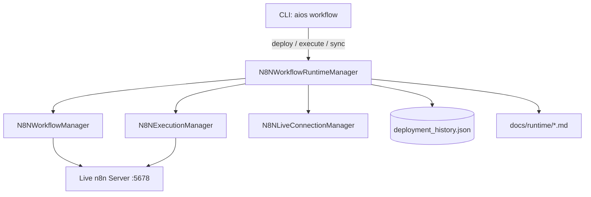

# n8n Workflow Runtime Architecture

Sprint 24B transforms AI OS from an n8n workflow generator into a complete
workflow runtime manager capable of deploying, executing, monitoring,
versioning, recovering, and synchronizing workflows on a live n8n instance.

---

## System Architecture



---

## Module: `core/src/aios/n8n/runtime.py`

### Class: `N8NWorkflowRuntimeManager`

| Method | Description |
|---|---|
| `deploy(wf, force)` | Upload or update workflow; records version in history |
| `execute(wf_id, input)` | Trigger a workflow execution run |
| `activate(wf_id)` | Enable / activate a workflow on n8n |
| `deactivate(wf_id)` | Disable / deactivate a workflow on n8n |
| `delete(wf_id)` | Permanently delete a workflow from n8n |
| `rollback(wf_id, version)` | Restore an earlier version from local history |
| `sync(local_wf)` | Detect node-level drift between local JSON and live server |
| `get_analytics()` | Compute success rate and failure stats from executions |
| `generate_runtime_reports(dir)` | Write 6 markdown docs under `docs/runtime/` |

---

## Deployment Flow

```
aios workflow deploy <file.json>
        │
        ▼
N8NWorkflowRuntimeManager.deploy()
        │
        ├─ list_workflows() → check if already deployed
        │
        ├─ force=False & exists → BLOCKED (no accidental overwrites)
        │
        ├─ force=True & exists → update_workflow()
        │
        └─ not exists → upload_workflow()
                │
                └─ Record version in deployment_history.json
```

---

## Version History

Every successful deployment appends to `.aios_n8n_cache/deployment_history.json`:

```json
{
  "wf_abc123": [
    { "version": 1, "timestamp": 1720000000.0, "workflow": { ... } },
    { "version": 2, "timestamp": 1720001000.0, "workflow": { ... } }
  ]
}
```

Rollback restores any prior version by re-uploading its `workflow` snapshot and
appending a new entry so the audit trail is never destroyed.

---

## Drift Detection (Sync)

`sync(local_wf)` compares node name sets:

- **No drift**: local and deployed node sets are identical → `{"drifted": false}`
- **Drift detected**: sets differ → `{"drifted": true, "reason": "Nodes mismatch …"}`
- **Not deployed**: workflow not found on server → `{"drifted": true}`

---

## Failure Recovery

| Scenario | Behavior |
|---|---|
| Server unreachable | Returns `{"success": false}` with error message |
| Execution fails | Exception caught; error returned in response dict |
| Rollback target missing | Returns descriptive error; no state change |
| Retry semantics | Caller controls retry via CLI; engine never retries infinitely |

---

## Runtime Reports

Generated under `docs/runtime/` on every deploy/execute:

| File | Contents |
|---|---|
| `deployment_report.md` | Active deployments, last deployment timestamp |
| `execution_report.md` | Total / success / failed run counts |
| `failure_report.md` | Failure count + auto-recovery suggestions |
| `runtime_analytics.md` | Success rate, average latency |
| `version_history.md` | Full version history per workflow |
| `synchronization_report.md` | Last drift check timestamp |

---

## CLI Reference

```bash
# Deploy workflow to live n8n
aios workflow deploy path/to/workflow.json

# Update a deployed workflow (force replace)
aios workflow update <workflow_id> path/to/workflow.json

# Trigger execution
aios workflow execute <workflow_id> ['{"key":"value"}']

# View execution analytics
aios workflow monitor

# Retrieve execution logs summary
aios workflow logs

# View deployment version history
aios workflow history <workflow_id>

# Roll back to a prior version
aios workflow rollback <workflow_id> <version_number>

# Enable / activate workflow
aios workflow enable <workflow_id>

# Disable / deactivate workflow
aios workflow disable <workflow_id>

# Delete workflow from server
aios workflow delete <workflow_id>

# Detect local-vs-live drift
aios workflow sync path/to/workflow.json
```
