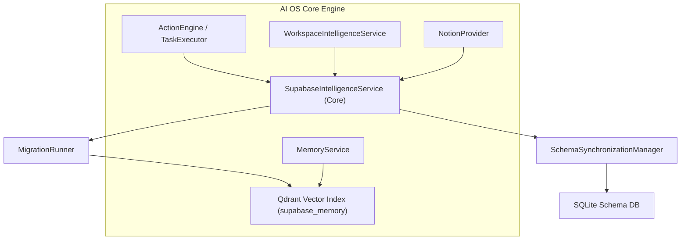

# Supabase Intelligence — Conceptual Vision & Product Framework
**Sprint 12 · Milestone 1 (Foundation)** · Version 1.0 · July 2026

---

## Document Metadata
* **Purpose**: Establish the core product vision, conceptual framework, and guiding principles of Supabase Intelligence.
* **Scope**: Governs all subsequent architectural and functional specifications of the Supabase module.
* **Audience**: Systems Architects, AI Developers, and the Owner.
* **Related Documents**:
  * [00_PROJECT_VISION.md](file:///Users/anzarakhtar/aios/docs/00_PROJECT_VISION.md) - Project Constitution.
  * [16_ENGINEERING_BIBLE.md](file:///Users/anzarakhtar/aios/docs/16_ENGINEERING_BIBLE.md) - Core system guidelines.
  * [supabase/README.md](file:///Users/anzarakhtar/aios/docs/supabase/README.md) - Navigation hub.

---

## 1. Executive Summary & Core Paradigm

The **Supabase Intelligence** module is the subsystem that enables the **Personal AI OS** to manage, query, and synchronize Supabase databases.

Under this paradigm, the AI OS serves as the reasoning and execution core. Supabase is treated as an **infrastructure provider**, not the system of record. The primary system of record remains the local developer database (SQLite or PostgreSQL). Supabase serves as a backing database target, receiving migrations, schemas updates, policy applications, and edge deployments compiled locally by the AI OS.

```
+------------------------------------------+       +------------------------------------------+
|          PERSONAL AI OS (Cognitive Core)  |       |     SUPABASE INSTANCE (Infrastructure)   |
|                                          |       |                                          |
|  - Relational Schema Catalog (SQLite)    |       |  - PostgreSQL Database                   |
|  - Local Migrations Folder (Truth)       | <===> |  - Schemas, Tables, Views, Functions     |
|  - Semantic Schema Index (Qdrant)        |       |  - Row-Level Security & Auth Systems     |
|  - Local-first SQL & Policy Compiler     |       |  - Storage Buckets & Edge Functions      |
+------------------------------------------+       +------------------------------------------+
```

---

## 2. Why Supabase Intelligence?

Modern web applications rely on backing cloud databases for storage, authentication, and hosting logic.
1. **Schema Management**: Developers must keep local ORM code synced with remote tables. The AI OS must dynamically inspect database states, write migrations, and apply them safely.
2. **Policy Auditing**: Row-Level Security (RLS) policies are prone to security vulnerabilities. The AI OS must audit RLS setups and test policies locally.
3. **Edge Deployment**: AI OS coordinates the compilation, testing, and deployment of Edge Functions to remote instances.
4. **State Synchronizations**: Local schema changes must sync to Supabase without conflicts or data loss.

---

## 3. Core Philosophy & Guiding Laws

Supabase Intelligence is governed by the following core laws:

### 3.1 Local-First Schema Truth
The local migration folder in the workspace is the source of truth. The system compiles changes locally into migration files before applying them to the remote Supabase database, preventing untracked schema drifts.

### 3.2 Declarative Infrastructure Configuration
Tables, functions, and RLS policies are managed declaratively. The system compares active database states against local configurations, generating SQL queries to reconcile differences.

### 3.3 Security Sandboxing & Guardrails
Database operations use safe connection profiles. High-risk operations (e.g. dropping tables, modifying Auth configurations, disabling RLS) must trigger user approval gates before running.

---

## 4. Subsystem Relationships

Supabase Intelligence integrates with core AI OS services:



* **Action Engine Integration**: Provides tools for running SQL queries, inspecting tables, and generating migrations.
* **Memory Service**: Indexes database schemas and migrations in Qdrant (`supabase_memory`) to support agent reasoning.
* **Workspace Service**: Feeds migration and schema status into active code compilation pipelines.
* **Notion Provider**: Publishes database schemas and documentation updates to Notion databases.
