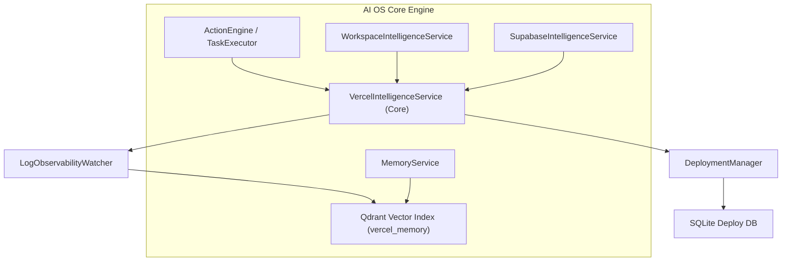

# Vercel Intelligence — Conceptual Vision & Product Framework
**Sprint 13 · Milestone 1 (Foundation)** · Version 1.0 · July 2026

---

## Document Metadata
* **Purpose**: Establish the core product vision, conceptual framework, and guiding principles of Vercel Intelligence.
* **Scope**: Governs all subsequent architectural and functional specifications of the Vercel module.
* **Audience**: Systems Architects, AI Developers, and the Owner.
* **Related Documents**:
  * [00_PROJECT_VISION.md](file:///Users/anzarakhtar/aios/docs/00_PROJECT_VISION.md) - Project Constitution.
  * [16_ENGINEERING_BIBLE.md](file:///Users/anzarakhtar/aios/docs/16_ENGINEERING_BIBLE.md) - Core system guidelines.
  * [vercel/README.md](file:///Users/anzarakhtar/aios/docs/vercel/README.md) - Navigation hub.

---

## 1. Executive Summary & Core Paradigm

The **Vercel Intelligence** module is the subsystem that enables the **Personal AI OS** to manage, inspect, and deploy applications to Vercel.

Under this paradigm, the AI OS serves as the reasoning and execution core. Vercel is treated as a **deployment and hosting provider**, not the system of record. The primary system of record remains the local developer workspace (Git repositories, local configurations, and build files). Vercel serves as a backing infrastructure target, receiving code bundles, environment variables, domain updates, and serverless logic compiled locally by the AI OS.

```
+------------------------------------------+       +------------------------------------------+
|          PERSONAL AI OS (Cognitive Core)  |       |      VERCEL INSTANCE (Infrastructure)    |
|                                          |       |                                          |
|  - Repositories configurations (Truth)   |       |  - Hosting Gateway & CDN Edge            |
|  - Local Build & Test Engines            | <===> |  - Project Builds & Deployments          |
|  - Semantic Deploy Index (Qdrant)        |       |  - Serverless & Edge Functions           |
|  - Local-first Variables & Domain Sync   |       |  - Realtime Logs & Analytics Observability|
+------------------------------------------+       +------------------------------------------+
```

---

## 2. Why Vercel Intelligence?

Modern front-end applications rely on serverless backends and edge hosting to deliver responsive user experiences.
1. **Deployment Management**: Developers must compile and deploy code. The AI OS must verify code quality locally, run test suites, and orchestrate deployments.
2. **Environment Synchronization**: Key secrets (e.g. database credentials, API tokens) must sync across services. The AI OS must update environment variables securely.
3. **Log Analysis & Observability**: Invocation errors in serverless functions require troubleshooting. The AI OS must analyze logs in real time to locate code issues.
4. **Domain Routing**: The system coordinates DNS routing and SSL certificate provisioning.

---

## 3. Core Philosophy & Guiding Laws

Vercel Intelligence is governed by the following core laws:

### 3.1 Local-First Configuration Truth
The local project files in the workspace are the source of truth. The system compiles build assets and verifies code locally before deploying, preventing untracked hosting configurations.

### 3.2 Declarative Infrastructure Configuration
Projects, domain mappings, and environment variables are managed declaratively. The system compares active project states against local configurations, generating API requests to reconcile differences.

### 3.3 Security Sandboxing & Guardrails
Outbound deployments use restricted token profiles. High-risk actions (e.g. updating production environment variables, deleting domains, promoting deployments) must trigger user approval gates before running.

---

## 4. Subsystem Relationships

Vercel Intelligence integrates with core AI OS services:



* **Action Engine Integration**: Provides tools for triggering builds, uploading variables, and monitoring deploy logs.
* **Memory Service**: Indexes deployment records and build histories in Qdrant (`vercel_memory`) to support agent reasoning.
* **Workspace Service**: Feeds build outputs and package details into active deployment workflows.
* **Supabase Service**: Synchronizes database connection strings with Vercel project environment variables.
