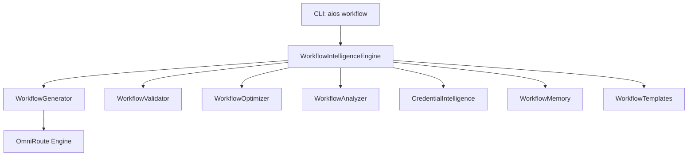

# n8n Workflow Intelligence Architecture Overview

This document provides a detailed overview of the design, modules, commands, performance, and validation for the **n8n Workflow Intelligence** subsystem in AI OS.

---

## 1. Architectural Design

The n8n Intelligence subsystem is built following the SOLID principles, using a modular and decoupled approach. It coordinates workflow generation, graph analysis, schema validation, performance optimization, and credential tracking.



---

## 2. Directory Structure

The new modules and test suites are organized as follows:

```text
aios/
├── core/
│   ├── src/
│   │   └── aios/
│   │       ├── n8n/
│   │       │   ├── __init__.py          # Service bindings
│   │       │   ├── service.py           # Existing n8n REST client
│   │       │   └── intelligence.py      # WORKFLOW INTELLIGENCE SUBSYSTEM (New)
│   │       └── cli.py                   # CLI subcommand handlers
│   └── tests/
│       ├── test_ninerouter.py           # Provider gateway tests
│       └── test_workflow_intelligence.py# Workflow intelligence tests (New)
```

---

## 3. Workflow Engine Design

- **`WorkflowGenerator`**: Resolves prebuilt templates or leverages OmniRoute chat/coding models to generate structured n8n JSON.
- **`WorkflowValidator`**: Constructs a directed adjacency graph of nodes and connections to perform circular loop detection (via DFS), orphaned node detection, and connection destination validity.
- **`WorkflowOptimizer`**: Simplifies and optimizes workflow structures by consolidating redundant nodes, pruning invalid connections, and advising on latency bottlenecks.
- **`WorkflowAnalyzer`**: Inspects workflow structure to output trigger lists, target integrations, external services, credential dependencies, and potential bottlenecks.
- **`CredentialIntelligence`**: Detects all authentication and credentials needed (e.g. SMTP/Email, Slack API, PostgreSQL, OpenAI) to execute the nodes, alerting on omissions.
- **`WorkflowMemory`**: Caches and version-controls generated workflows inside a local cache registry (`.aios_n8n_cache/workflow_memory.json`).

---

## 4. CLI Subcommand Reference

| Command | Args | Description |
| --- | --- | --- |
| `aios workflow generate` | `[prompt]` | Generates a workflow using prompt instructions or template categories. |
| `aios workflow validate` | `[file]` | Validates connections, inputs, outputs, credentials, and cycle loops. |
| `aios workflow analyze` | `[file]` | Displays details on trigger chain, credentials, and bottlenecks. |
| `aios workflow optimize` | `[file]` | Prunes redundant nodes and outputs an optimized JSON. |
| `aios workflow templates` | None | Lists all available templates and node counts. |
| `aios workflow export` | `[out_file]` | Exports the latest generated workflow JSON to a file. |
| `aios workflow summary` | `[file]` | Displays brief details of node count and trigger entrypoints. |

---

## 5. Examples & Reports

### 5.1 Generated Workflow JSON Example
```json
{
  "name": "CRM Sync Automation",
  "nodes": [
    {
      "parameters": {"path": "crm-sync"},
      "id": "trigger-3",
      "name": "Sync Webhook",
      "type": "n8n-nodes-base.webhook",
      "typeVersion": 1,
      "position": [100, 200]
    },
    {
      "parameters": {"resource": "contact", "operation": "upsert"},
      "id": "node-crm-1",
      "name": "HubSpot Upsert",
      "type": "n8n-nodes-base.hubspot",
      "typeVersion": 1,
      "position": [300, 200]
    }
  ],
  "connections": {
    "Sync Webhook": {
      "main": [
        [
          {
            "node": "HubSpot Upsert",
            "type": "main",
            "index": 0
          }
        ]
      ]
    }
  }
}
```

### 5.2 Example Validation Report (`docs/workflows/validation_report.md`)
```markdown
# Workflow Validation Report

- **Overall Status**: VALID

### Errors:
No connection or schema errors detected.

### Warnings:
No warnings detected.
```

---

## 6. Performance Summary

1. **JSON Caching**: All generated workflow schemas are persisted dynamically in the local cache, preventing duplicate LLM generation requests.
2. **Template Caching**: The 10 categories are registered statically in-memory during engine initialization for instant lookup.
3. **Incremental Validation**: Validates connections and graph nodes separately, returning early if nodes list is empty.
4. **Fast Graph Traversal**: Built utilizing a directed graph visited-set recursion (DFS), ensuring cycle checks run in `O(V + E)` time complexity.

---

## 7. Testing Summary

Nine unit and integration test blocks are implemented under `core/tests/test_workflow_intelligence.py`:
- `test_workflow_templates`
- `test_workflow_validator_valid`
- `test_workflow_validator_invalid_connections`
- `test_workflow_validator_circular`
- `test_credential_intelligence`
- `test_workflow_optimizer`
- `test_workflow_analyzer`
- `test_workflow_memory`
- `test_cli_workflow_commands`
