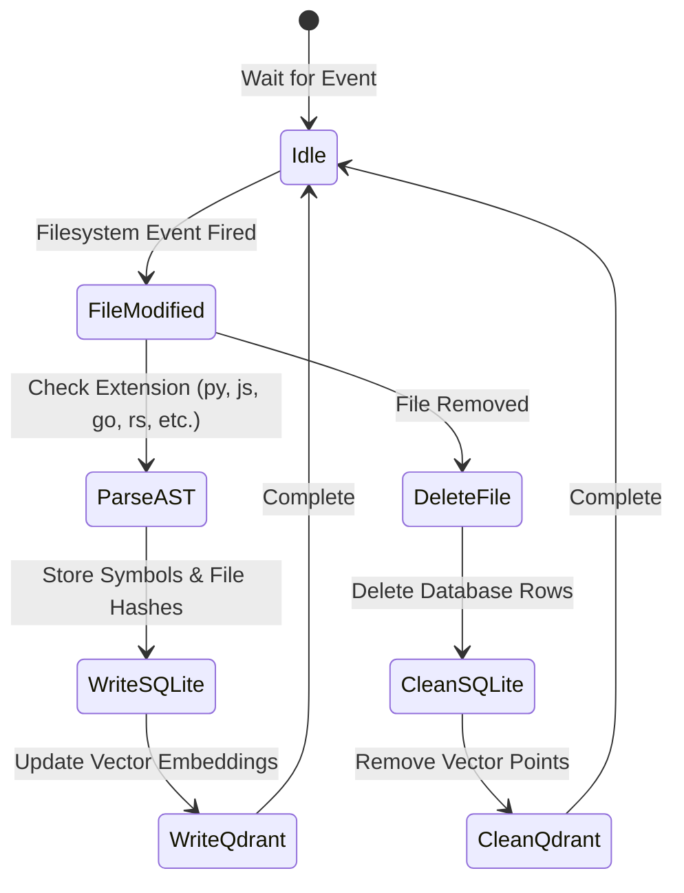

# Workspace Intelligence — Architecture Specification
**Sprint 10 · Milestone 1 (Foundation)** · Version 1.0 · July 2026

---

## Document Metadata
* **Purpose**: Define the technical architecture, class interfaces, components, and database schemas for the Workspace Intelligence module.
* **Scope**: Governs Python service classes, local file system watchers, AST compilers, and terminal monitors.
* **Audience**: Systems Architects, Lead Developers, and AI coding agents.
* **Related Documents**:
  * [02_ARCHITECTURE_GUIDELINES.md](file:///Users/anzarakhtar/aios/docs/02_ARCHITECTURE_GUIDELINES.md) - Dependency Injection rules.
  * [17_KNOWLEDGE_BASE.md](file:///Users/anzarakhtar/aios/docs/17_KNOWLEDGE_BASE.md) - Core system data models catalog.
  * [workspace/workspace_intelligence.md](file:///Users/anzarakhtar/aios/docs/workspace/workspace_intelligence.md) - Conceptual vision.

---

## 1. High-Level Architecture

Following the **Dependency Inversion Principle (DIP)** established in [02_ARCHITECTURE_GUIDELINES.md](file:///Users/anzarakhtar/aios/docs/02_ARCHITECTURE_GUIDELINES.md), the `WorkspaceIntelligenceService` registers concrete adapters to interact with the filesystem, compilers, terminal APIs, and Git hooks.

```
                  +-----------------------------------+
                  |        ServiceRegistry            |
                  +-----------------------------------+
                                    |
                                    v
                  +-----------------------------------+
                  |    WorkspaceIntelligenceService   |
                  +-----------------------------------+
                                    |
                                    v
                  +-----------------------------------+
                  |        WorkspaceObserver          | (Abstract Interface)
                  +-----------------------------------+
                                    ^
                                    |
                  +-----------------------------------+
                  |         LocalWorkspace            | (Concrete Implementation)
                  +-----------------------------------+
                    /                |                \
                   v                 v                 v
       +---------------+     +---------------+     +---------------+
       |   FileSystem  |     |   Build       |     |   Git & Shell |
       |    Watcher    |     |   Tracker     |     |    Monitor    |
       +---------------+     +---------------+     +---------------+
               |                     |                     |
               v                     v                     v
       +---------------+     +---------------+             |
       | Qdrant Vector |     | SQLite Cache  |             v
       | (Symbol DB)   |     | (SQLCipher)   |     [Process Sandbox]
       +---------------+     +---------------+
```

---

## 2. Component Deep Dive

### 2.1 WorkspaceIntelligenceService
* **Namespace**: `aios.services.workspace`
* **Responsibility**: Central coordinator for registering workspace paths, triggering AST parsers, monitoring terminal events, and indexing code symbols.
* **Interface**:
  ```python
  class WorkspaceIntelligenceService(ABC):
      @abstractmethod
      def register_workspace(self, workspace_path: str) -> bool:
          """Register a root development folder for observation and indexing."""
          pass

      @abstractmethod
      def get_symbol_location(self, symbol_name: str) -> List[FileSymbol]:
          """Query the local index to find class, function, or type declarations."""
          pass

      @abstractmethod
      def execute_command(self, cmd: str, timeout_seconds: int = 300) -> TerminalSession:
          """Execute a command in the sandboxed terminal wrapper and return stdout logs."""
          pass

      @abstractmethod
      def get_build_context(self) -> BuildContext:
          """Retrieve the current compile dependencies, lockfiles, and compiler settings."""
          pass
  ```

### 2.2 LocalWorkspace
* **Namespace**: `aios.providers.workspace.local`
* **Responsibility**: Implements `WorkspaceObserver`. Translates file notifications into structural updates, runs python AST analyzers, monitors environment locks, and manages local git status.
* **Interface**:
  ```python
  class LocalWorkspace(WorkspaceObserver):
      def scan_files(self) -> List[WorkspaceFile]:
          """Scan directory recursively, skipping .gitignore patterns, returning file details."""
          pass

      def get_file_ast(self, relative_path: str) -> FileAST:
          """Compile source code file, returning abstract syntax tree symbols and locations."""
          pass

      def verify_path_containment(self, path: str) -> bool:
          """Ensure that path queries target locations strictly within the workspace boundaries."""
          pass
  ```

### 2.3 WorkspaceStateStore
* **Namespace**: `aios.providers.workspace.storage`
* **Responsibility**: Manages the local SQLite database cache tracking modified timestamps, symbol locations, terminal history, and build runs.
* **Schema**:
  ```sql
  CREATE TABLE IF NOT EXISTS workspace_metadata (
      file_path TEXT PRIMARY KEY,
      relative_path TEXT NOT NULL,
      last_modified TIMESTAMP NOT NULL,
      sha256 TEXT NOT NULL,
      is_binary INTEGER CHECK(is_binary IN (0, 1)) NOT NULL
  );

  CREATE TABLE IF NOT EXISTS code_symbols (
      symbol_id TEXT PRIMARY KEY,
      symbol_name TEXT NOT NULL,
      symbol_type TEXT CHECK(symbol_type IN ('CLASS', 'METHOD', 'FUNCTION', 'STRUCT', 'VARIABLE')) NOT NULL,
      file_path TEXT NOT NULL,
      start_line INTEGER NOT NULL,
      end_line INTEGER NOT NULL,
      docstring TEXT,
      FOREIGN KEY(file_path) REFERENCES workspace_metadata(file_path) ON DELETE CASCADE
  );

  CREATE TABLE IF NOT EXISTS terminal_execution_history (
      session_id TEXT PRIMARY KEY,
      command_line TEXT NOT NULL,
      exit_code INTEGER,
      started_at TIMESTAMP DEFAULT CURRENT_TIMESTAMP,
      finished_at TIMESTAMP,
      stdout_log_path TEXT,
      stderr_log_path TEXT
  );
  ```

---

## 3. Observer Loop & Processing Flow

Workspace Intelligence runs background filesystem watchers to keep local databases and Qdrant vector memory updated with code symbols.



### 3.1 Code AST Symbol Extraction
When a supported file modification occurs:
1. The compiler parses the source file into an AST (Abstract Syntax Tree).
2. For each class, function, or block definition, it generates a unique symbol identifier.
3. The symbol is indexed into SQLite with line coordinates and docstrings.
4. The text block representing the symbol signature and contents is embedded via `all-MiniLM-L6-v2` (384d Cosine distance) and saved to Qdrant, allowing agents to instantly resolve code targets semantically.
