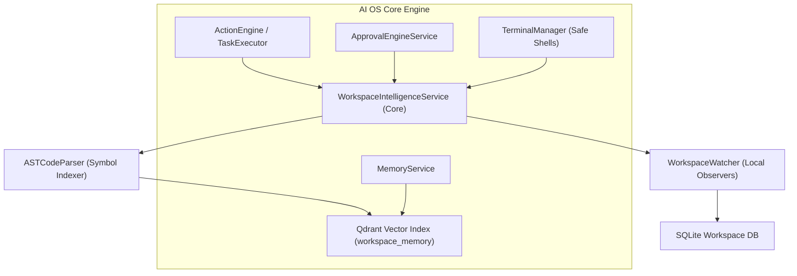

# Workspace Intelligence — Conceptual Vision & Product Framework
**Sprint 10 · Milestone 1 (Foundation)** · Version 1.0 · July 2026

---

## Document Metadata
* **Purpose**: Establish the core product vision, conceptual framework, and guiding principles of Development Workspace Intelligence.
* **Scope**: Governs all subsequent architectural, capability, and security models of the Workspace Intelligence subsystem.
* **Audience**: Systems Architects, AI Developers, and the Owner.
* **Related Documents**:
  * [00_PROJECT_VISION.md](file:///Users/anzarakhtar/aios/docs/00_PROJECT_VISION.md) - Project Constitution.
  * [16_ENGINEERING_BIBLE.md](file:///Users/anzarakhtar/aios/docs/16_ENGINEERING_BIBLE.md) - Core system guidelines.
  * [workspace/README.md](file:///Users/anzarakhtar/aios/docs/workspace/README.md) - Navigation hub.

---

## 1. Executive Summary & Core Paradigm

The **Development Workspace Intelligence** subsystem is the bridge connecting the cognitive execution layer of the **Personal AI OS** to the physical filesystems, compilers, version control systems, terminals, and IDE toolchains used by developers.

Traditional AI coding assistants function as external editor extensions that make simple API queries to retrieve files and stream code completions. Under the Personal AI OS paradigm, the relationship is inverted: the AI OS is the primary execution and reasoning core, and the local workspace is a fully observable and safe execution environment.

```
+------------------------------------------+       +------------------------------------------+
|          PERSONAL AI OS (Cognitive Core)  |       |        DEVELOPER WORKSPACE (Physical)    |
|                                          |       |                                          |
|  - Agent Reasoning & Plan Generation     |       |  - Filesystem & AST Parser Cache         |
|  - Hybrid Memory Index (SQLite + Qdrant) | <===> |  - Build Systems (Pip, Npm, compilers)   |
|  - Process & Terminal Sandbox            |       |  - Version Control (Git history & diffs) |
|  - Human Approval consensus loops        |       |  - IDE Interactivity (LSP & editor APIs) |
+------------------------------------------+       +------------------------------------------+
```

* **The Workspace is the Sandbox**: It contains repositories, dependencies, build processes, and active terminal sessions.
* **Personal AI OS is the Controller**: It sits outside the workspace, observing file modifications, tracking command line execution, parsing compiler errors, indexing symbols, and executing tasks safely.

---

## 2. Why Workspace Intelligence?

While general language models can generate code snippets, true autonomous software engineering requires the AI OS to possess situational awareness of the environment where that code runs:
1. **Contextual Completeness**: Code cannot be safely modified without understanding its abstract syntax tree (AST), class hierarchies, imports, dependencies, and active branch state.
2. **Deterministic Validation**: The AI OS must compile the code, run tests, analyze stdout/stderr logs, and resolve package locks itself to verify that generated code is correct.
3. **Continuous Execution**: Developers do not work in isolation; they run active build watch loops and terminal commands. The AI OS must observe terminal streams to detect compiler crashes, test failures, or CPU bottlenecks.
4. **Local-First Speed**: Source code semantic indexers must operate on the local machine to avoid uploading intellectual property to cloud services, ensuring ultra-low latency queries.

---

## 3. Core Philosophy & Guiding Laws

The Development Workspace Intelligence subsystem is governed by the following core laws:

### 3.1 Local-First & Privacy Preserving
All source code parsers, AST builders, and embedding pipelines run locally. Source code, credentials, and console outputs must never be uploaded to external servers for indexing. Local execution ensures that operations remain fast and functional even when offline.

### 3.2 AI OS as the Reasoning & Execution Core
The IDE editor or shell is not the executor; the AI OS kernel is the center of gravity. Editors and terminals serve as input/output interfaces. All code intelligence, reasoning plans, tool calls, and state machines are managed centrally by the OS.

### 3.3 Zero-Trust Path Containment
Every file write, command execution, and compiler call must be verified against workspace path boundaries. System commands are run in a controlled shell container with strict resource limits, preventing agents from mutating resources outside the user's explicit workspace directories.

---

## 4. Subsystem Relationships

Workspace Intelligence integrates with core AI OS services to enable seamless developer assistance:



* **Action Engine Integration**: Provides tools for git commits, package installations, file editing, and test executions.
* **Memory Service**: Injects code symbol indexes, AST paths, and build logs into the local vector DB to provide agents with perfect code context.
* **Terminal Manager**: Monitors shell environments and alerts the reasoning core when commands complete or fail.
* **Approval Engine**: Prompts the user before executing destructive commands like force pushes, package uninstalls, or environment cleans.
